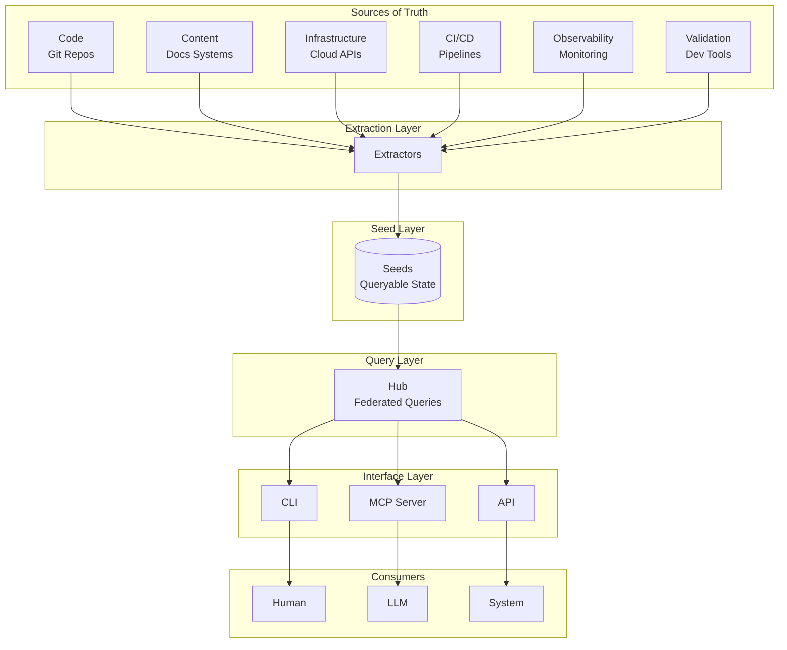
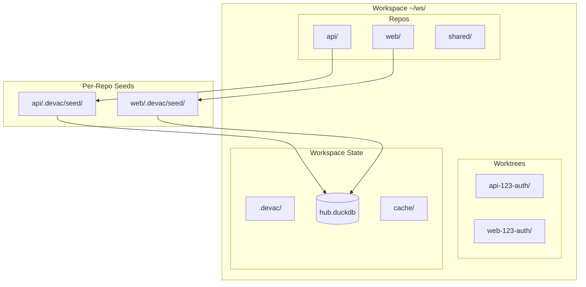
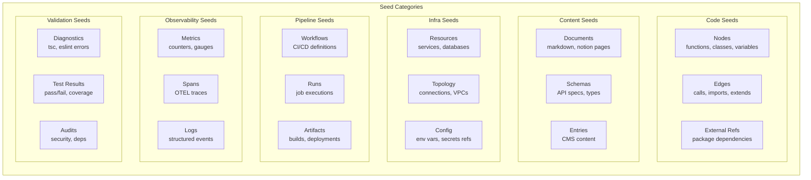
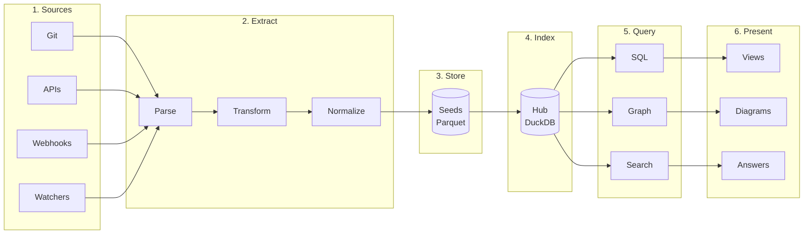
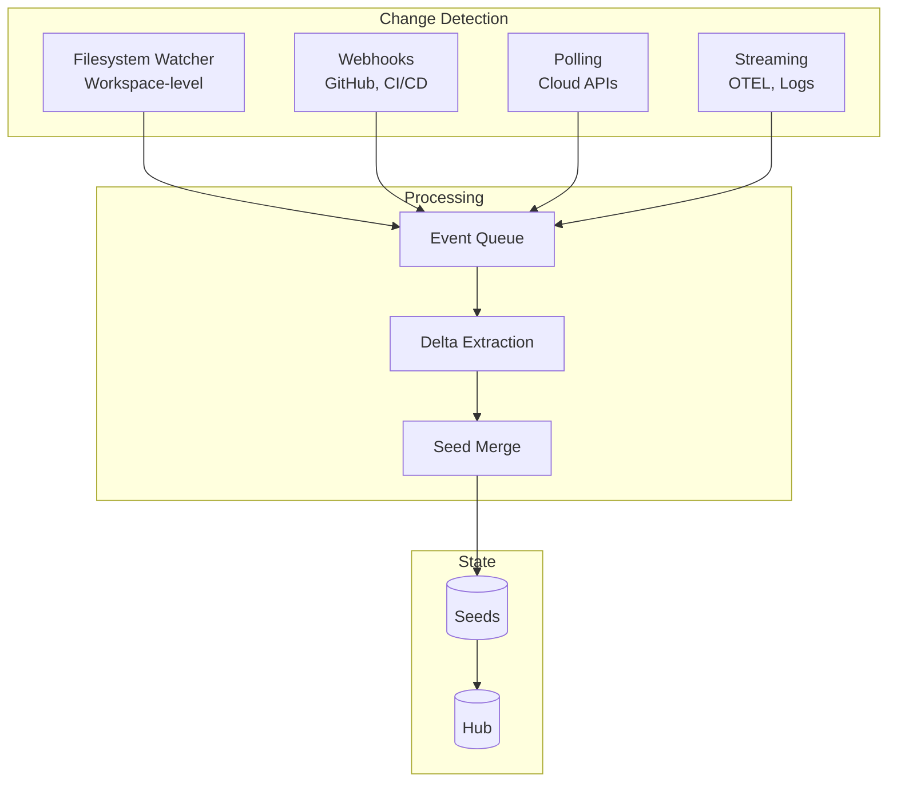
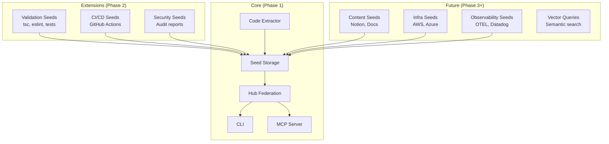
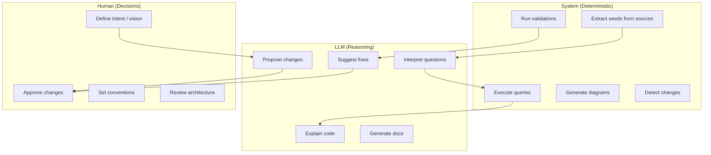
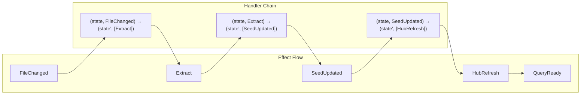

# DevAC v3 Architecture

> High-level architecture for the next generation of DevAC
> Status: Planning / Alignment Phase

---

## 1. System Overview



---

## 2. Workspace Model



**Convention-Based Discovery:**
- Workspace = directory containing multiple git repos
- Repo = any git repository in workspace
- Worktree = directory matching `{repo}-{issue}-{slug}` pattern
- No registration required - all discovered automatically

---

## 3. Seed Taxonomy

**Seeds vs Effects**: Seeds are **queryable data** extracted from sources. Effects are **events/changes** that flow through the system (see Section 9). All seed categories are updated via effects when their source changes.



**Seed Data Structures:**

| Category | Primary Tables | Key Fields |
|----------|---------------|------------|
| Code | nodes, edges, external_refs | entity_id, kind, file, line |
| Content | documents, entries | id, source, content_hash |
| Infra | resources, topology | arn/id, type, region |
| Pipeline | workflows, runs | workflow_id, status, timestamp |
| Observability | metrics, spans | trace_id, name, duration |
| Validation | diagnostics, test_results | file, line, severity, message |

---

## 4. Query Capabilities Matrix

| Seed Category | Graph | Relational | K-V | Full-Text | Vector | Time-Series | OTEL |
|---------------|:-----:|:----------:|:---:|:---------:|:------:|:-----------:|:----:|
| Code          | ✓     | ✓          | ✓   | ✓         | ◐      | -           | -    |
| Content       | ◐     | ✓          | ✓   | ✓         | ✓      | -           | -    |
| Infra         | ✓     | ✓          | ✓   | ✓         | -      | -           | -    |
| Pipeline      | ◐     | ✓          | ✓   | ✓         | -      | ✓           | -    |
| Observability | ◐     | ✓          | ✓   | ✓         | -      | ✓           | ✓    |
| Validation    | -     | ✓          | ✓   | ✓         | -      | ✓           | -    |

*✓ = Primary, ◐ = Secondary, - = Not applicable*

**Query Implementation:** SQL-first with graph traversal via recursive CTEs (current DevAC v2 approach).

---

## 5. Data Flow Pipeline



---

## 6. Update Mechanisms



**Update Strategies:**

| Source Type | Mechanism | Latency | Example |
|-------------|-----------|---------|---------|
| Local files | Filesystem watch | ~100ms | Code changes |
| GitHub | Webhooks (smee) | ~1s | PR events, CI status |
| Cloud APIs | Polling | ~1-5min | AWS resources |
| Monitoring | Streaming | Real-time | OTEL traces |

---

## 7. Component Boundaries



---

## 8. Human / LLM / System Boundaries



---

## 9. Effect Handler Integration



**The Universal Pattern:**

```
effectHandler = (state, effect) => (state', [effect'])
```

Effects are NOT specific to code - they're the universal abstraction for ALL changes in the system.

**Effects by Seed Category:**

| Category | Trigger Effects | Processing Effects | Result Effects |
|----------|----------------|-------------------|----------------|
| Code | `FileChanged`, `GitCommit` | `ParseAST`, `BuildGraph` | `NodesUpdated`, `EdgesUpdated` |
| Content | `DocumentChanged`, `CMSWebhook` | `ParseMarkdown`, `FetchContent` | `DocumentsUpdated` |
| Infra | `APIPolled`, `ResourceChanged` | `FetchTopology` | `ResourcesUpdated` |
| Pipeline | `WebhookReceived`, `WorkflowTriggered` | `FetchRunStatus` | `RunsUpdated` |
| Observability | `SpanReceived`, `MetricPushed` | `AggregateMetrics` | `SpansUpdated` |
| Validation | `FileChanged`, `DepsChanged` | `RunTypeCheck`, `RunLint` | `DiagnosticsUpdated` |

**Effect Flow Categories:**
- **Trigger**: Something changed in a source of truth
- **Processing**: Extract, transform, validate
- **State Update**: Seeds updated, hub refreshed
- **Query**: Request data, return results

---

## 10. Phasing Summary

### Phase 1 - Core (Current Focus)

| Component | Status | Description |
|-----------|--------|-------------|
| Code Seeds | ✅ Done | AST extraction for TS, Python, C# , make sure its nicely integrated in the new context |
| Workspace Discovery | Planned | Convention-based repo/worktree detection |
| Unified Watcher | Planned | Single workspace-level filesystem watcher |
| Hub Auto-refresh | Planned | Automatic hub updates on seed changes |

### Phase 2 - Validation

| Component | Status | Description |
|-----------|--------|-------------|
| TypeScript Errors | Planned | Extract `tsc` diagnostics as seeds |
| ESLint Issues | Planned | Extract lint results as seeds |
| Test Results | Planned | Extract test outcomes as seeds |
| Security Audits | Planned | Extract `npm audit` / dependency checks |

### Phase 3 - CI/CD

| Component | Status | Description |
|-----------|--------|-------------|
| GitHub Webhooks | Planned | Receive PR/issue/CI events via smee |
| CI Run Seeds | Planned | Extract GitHub Actions run status |
| PR Status Seeds | Planned | Extract PR checks, reviews, merge state |

### Future

| Component | Description |
|-----------|-------------|
| Content Seeds | Notion, Markdown docs, Contentful |
| Infra Seeds | AWS/Azure resource topology |
| Observability Seeds | OTEL traces, Datadog metrics |
| Vector Queries | Semantic search over content |

---

## Alignment Decisions

| Question | Decision |
|----------|----------|
| **Phase 1 Scope** | Yes - workspace discovery + unified watcher + hub auto-refresh. Code extraction (existing) is inherently Phase 1. |
| **Seed Format** | Seed-type-specific schemas. Current: nodes, edges, ext_references. Generalize where logical, keep specific where needed. Effect handler pattern is generic but apply carefully. |
| **Query Interface** | SQL-first with graph via recursive CTEs (current DevAC v2 approach). No dedicated graph language needed. |
| **Real-time vs Batch** | Pragmatic per-seed. Real-time when possible, batch when sensible. Generic choices that make sense. |
| **LLM Integration** | MCP for both querying AND triggering extractions. CLI/API already implement it - maintain consistency. Skills are part of the future. |

---

*Document Version: 0.3 - Seeds vs Effects clarified*
*Status: Ready for detailed design*
