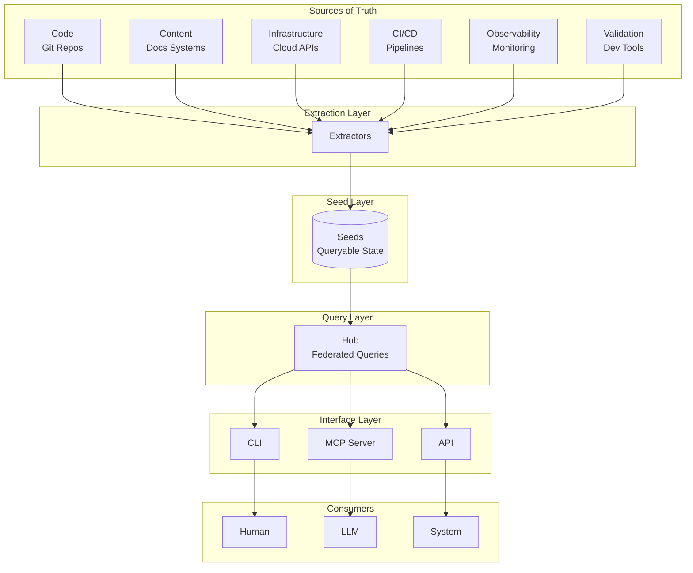
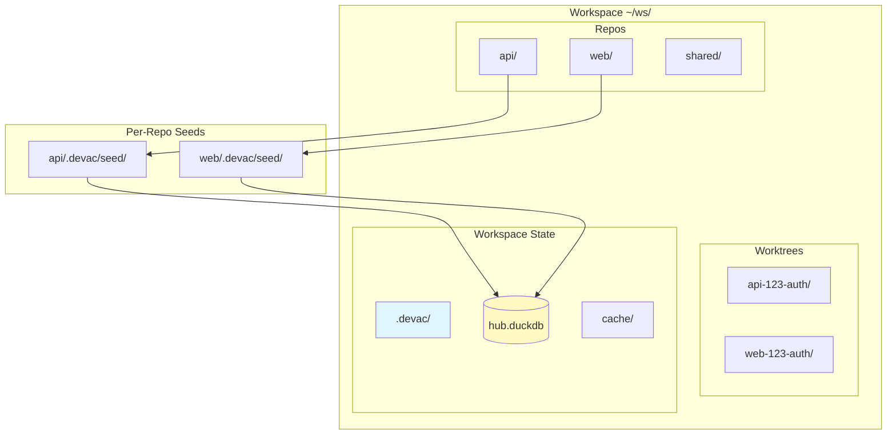
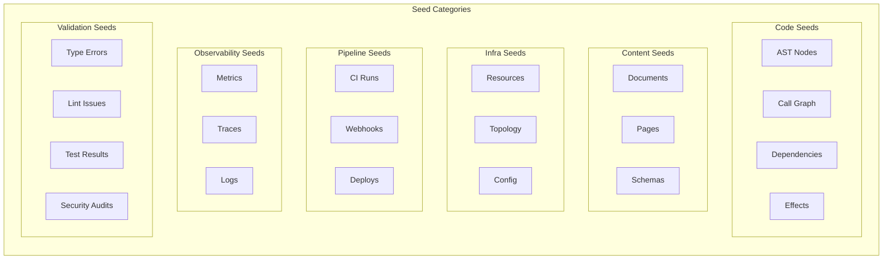
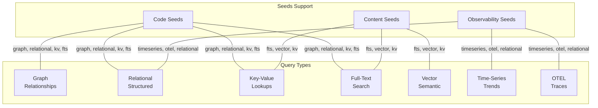
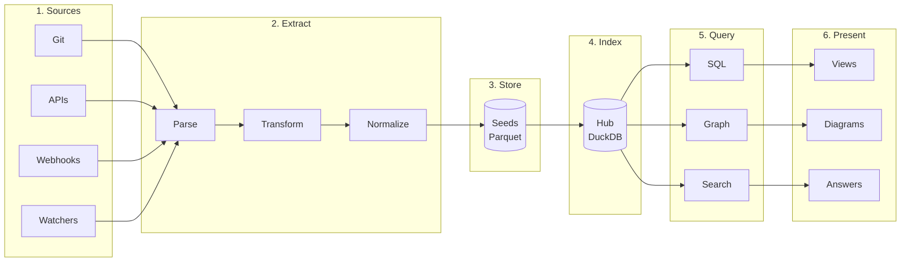
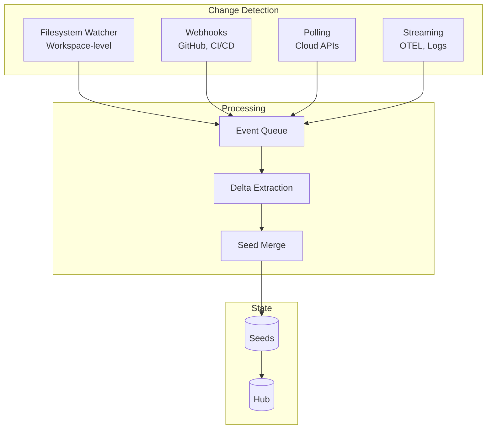
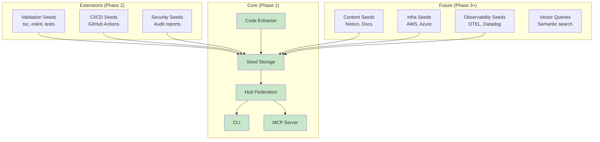
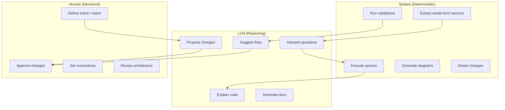
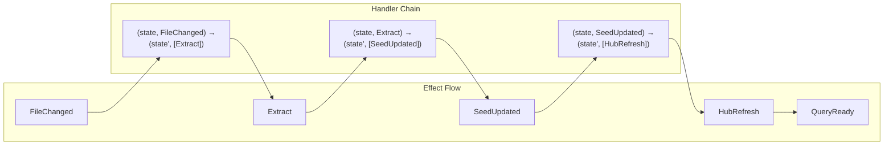

# DevAC v3 Architecture

> High-level architecture for the next generation of DevAC
> Status: Planning / Alignment Phase

---

## 1. System Overview

---

## 2. Workspace Model

**Convention-Based Discovery:**
- Workspace = directory containing multiple git repos
- Repo = any git repository in workspace
- Worktree = directory matching `{repo}-{issue}-{slug}` pattern
- No registration required - all discovered automatically

---

## 3. Seed Taxonomy

---

## 4. Query Capabilities Matrix

**Query Type Support by Seed Category:**

| Seed Category | Graph | Relational | K-V | Full-Text | Vector | Time-Series | OTEL |
|---------------|:-----:|:----------:|:---:|:---------:|:------:|:-----------:|:----:|
| Code          | ✓     | ✓          | ✓   | ✓         | ◐      | -           | -    |
| Content       | ◐     | ✓          | ✓   | ✓         | ✓      | -           | -    |
| Infra         | ✓     | ✓          | ✓   | ✓         | -      | -           | -    |
| Pipeline      | ◐     | ✓          | ✓   | ✓         | -      | ✓           | -    |
| Observability | ◐     | ✓          | ✓   | ✓         | -      | ✓           | ✓    |
| Validation    | -     | ✓          | ✓   | ✓         | -      | ✓           | -    |

*✓ = Primary, ◐ = Secondary, - = Not applicable*

---

## 5. Data Flow Pipeline

---

## 6. Update Mechanisms

**Update Strategies:**

| Source Type | Mechanism | Latency | Example |
|-------------|-----------|---------|---------|
| Local files | Filesystem watch | ~100ms | Code changes |
| GitHub | Webhooks (smee) | ~1s | PR events, CI status |
| Cloud APIs | Polling | ~1-5min | AWS resources |
| Monitoring | Streaming | Real-time | OTEL traces |

---

## 7. Component Boundaries

---

## 8. Human / LLM / System Boundaries

---

## 9. Effect Handler Integration

**Everything is an effect:**
- Source changes → `FileChanged`, `WebhookReceived`, `APIPolled`
- Processing → `Extract`, `Transform`, `Merge`
- State updates → `SeedUpdated`, `HubRefreshed`
- Queries → `QueryRequested`, `ResultReturned`

---

## 10. Phasing Summary

```mermaid
gantt
    title DevAC v3 Phases
    dateFormat X
    axisFormat %s

    section Phase 1 - Core
    Code Seeds (existing)      :done, p1a, 0, 1
    Workspace Discovery        :p1b, 1, 2
    Unified Watcher           :p1c, 2, 3
    Hub Auto-refresh          :p1d, 3, 4

    section Phase 2 - Validation
    TypeScript Errors         :p2a, 4, 5
    ESLint Issues            :p2b, 5, 6
    Test Results             :p2c, 6, 7
    Security Audits          :p2d, 7, 8

    section Phase 3 - CI/CD
    GitHub Webhooks          :p3a, 8, 9
    CI Run Seeds             :p3b, 9, 10
    PR Status Seeds          :p3c, 10, 11

    section Future
    Content Seeds            :p4a, 11, 12
    Infra Seeds              :p4b, 12, 13
    Observability Seeds      :p4c, 13, 14
    Vector Queries           :p4d, 14, 15
```

---

## Key Questions for Alignment

1. **Phase 1 Scope**: Is workspace discovery + unified watcher + hub auto-refresh the right starting point?

2. **Seed Format**: Should all seeds use the same Parquet schema, or allow seed-type-specific schemas?

3. **Query Interface**: SQL-first with graph as recursive CTEs, or add a dedicated graph query language?

4. **Real-time vs Batch**: Which seeds need real-time updates vs periodic refresh?

5. **LLM Integration**: MCP tools for querying, or also for triggering extractions?

---

*Document Version: 0.1 - Initial Architecture Diagrams*
*Status: Awaiting alignment feedback*
