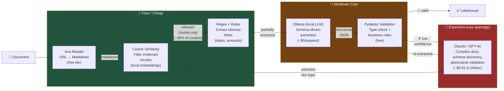
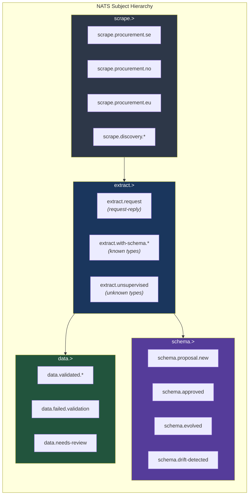
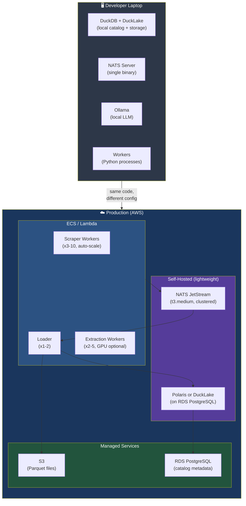

# Technology Stack Map & Component Detail

## Concrete Technology Choices per Layer

```mermaid
graph TB
    subgraph Scraping["Acquisition Layer"]
        direction LR
        BU["🔧 Browser-Use\n<i>portal navigation,\nlogin, pagination</i>"]
        C4["🔧 Crawl4AI\n<i>bulk crawling,\ncosine filtering</i>"]
        JN["🔧 Jina Reader\n<i>quick URL→markdown,\nPDF reading</i>"]
        LW["🔧 LLMWhisperer\n<i>scanned docs,\nhandwriting OCR</i>"]
    end

    subgraph Messaging["Messaging & Coordination"]
        direction LR
        NS["🔧 NATS JetStream\n<i>streams, KV store,\nobject store, req-reply</i>"]
    end

    subgraph Extraction["Extraction & Intelligence"]
        direction LR
        CL["🔧 Claude / GPT-4o\n<i>complex extraction,\nschema proposals</i>"]
        OL["🔧 Ollama (local)\n<i>Llama/Qwen for\nhigh-volume extraction</i>"]
        EM["🔧 all-MiniLM-L6-v2\n<i>embeddings for\nclustering & similarity</i>"]
        PY["🔧 Pydantic\n<i>schema definitions,\nvalidation</i>"]
    end

    subgraph Storage["Lakehouse Storage"]
        direction LR
        S3["🔧 AWS S3\n<i>data files\n(Parquet)</i>"]
        PG["🔧 PostgreSQL\n<i>catalog metadata\n(DuckLake or Polaris)</i>"]
    end

    subgraph Catalog["Catalog Options"]
        direction LR
        DL["🔧 DuckLake\n<i>simplest, DuckDB-native\nbest for starting</i>"]
        PO["🔧 Polaris\n<i>REST catalog, RBAC\nmulti-engine</i>"]
        NE["🔧 Nessie\n<i>Git branching\nschema proposals</i>"]
    end

    subgraph Query["Query & Analysis"]
        direction LR
        DD["🔧 DuckDB\n<i>dev, analytics,\nfast iteration</i>"]
        TR["🔧 Trino\n<i>multi-user,\ndashboards</i>"]
    end

    Scraping --> Messaging
    Messaging --> Extraction
    Extraction --> Storage
    Storage --- Catalog
    Catalog --> Query

    style Scraping fill:#2d3748,color:#fff
    style Messaging fill:#4a5568,color:#fff
    style Extraction fill:#1a365d,color:#fff
    style Storage fill:#22543d,color:#fff
    style Catalog fill:#553c9a,color:#fff
    style Query fill:#744210,color:#fff
```



## Cost-Optimized Extraction Pipeline

> Key insight: use cheap/free tools for filtering, 
> expensive LLMs only for the hard parts.



## Data Flow Through NATS Subjects



## Deployment View — Minimal Viable Setup



## Decision Matrix — Which Architecture to Start With

```
                        Your Situation
                        ─────────────────────────────────────────
                        │ < 5 sources,   │ 5-20 sources,  │ 20+ sources,
                        │ stable schemas │ some new ones   │ many countries
                        │                │ occasionally    │ evolving fast
┌───────────────────────┼────────────────┼────────────────┼──────────────┐
│ Schema-First (Alt A)  │  ✅ START HERE │  ⚠️ works but  │  ❌ doesn't  │
│                       │  simple, fast  │  onboarding is │  scale       │
│                       │  predictable   │  a bottleneck  │              │
├───────────────────────┼────────────────┼────────────────┼──────────────┤
│ Progressive (Alt B)   │  overkill      │  ✅ SWEET SPOT │  ✅ good     │
│                       │                │  fast+slow path│  balance     │
│                       │                │  human gate    │              │
├───────────────────────┼────────────────┼────────────────┼──────────────┤
│ Self-Organizing       │  overkill      │  premature     │  ✅ THE GOAL │
│ (Full Vision)         │                │                │  if you can  │
│                       │                │                │  invest in it│
└───────────────────────┴────────────────┴────────────────┴──────────────┘

Recommended path: Start with A → evolve to B → aim for full vision
Each stage is independently useful, not wasted work
```
