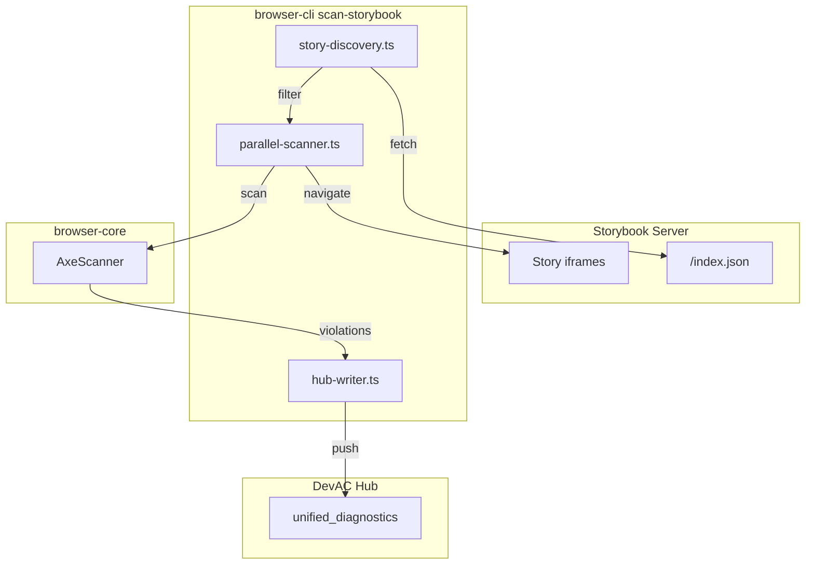
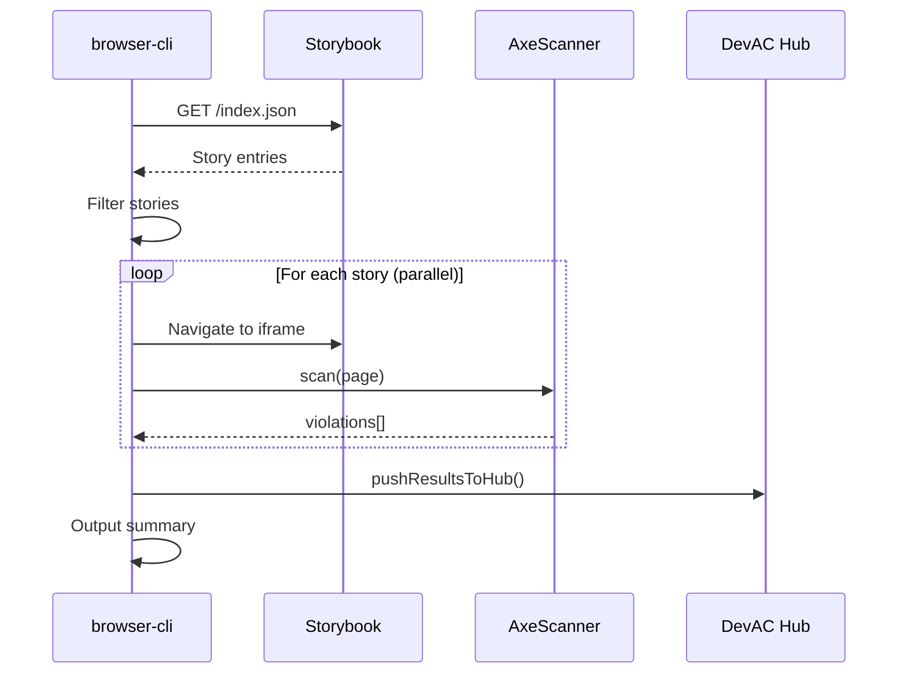

# Scan Storybook for Accessibility - Getting Started

This guide walks you through setting up and running accessibility scans on your Storybook stories.

## Overview

The `browser scan-storybook` command automates accessibility testing by:

1. Fetching story metadata from Storybook's `/index.json` endpoint
2. Scanning each story with axe-core via Playwright
3. Aggregating violations into a summary report
4. Optionally pushing results to DevAC hub for LLM visibility

## Prerequisites

- **Storybook 7+**: The command uses Storybook's `index.json` format (CSF3)
- **Running Storybook server**: Start your Storybook before scanning
- **DevAC workspace** (optional): For hub integration, run `devac sync` first

## Quick Start

```bash
# 1. Start your Storybook
npm run storybook

# 2. Install browser-cli (if not already installed)
pnpm add -g @pietgk/browser-cli

# 3. Run the scan
browser scan-storybook

# 4. View results (JSON output)
browser scan-storybook --json
```

## Architecture

The scan-storybook command has three main components:



### Scan Workflow Sequence



## Command Options

| Option | Default | Description |
|--------|---------|-------------|
| `--url <url>` | `http://localhost:6006` | Storybook base URL |
| `--workers <n>` | `4` | Number of parallel browser pages |
| `--timeout <ms>` | `30000` | Timeout per story in milliseconds |
| `--wcag <level>` | `wcag21aa` | WCAG conformance level (`wcag2a`, `wcag2aa`, `wcag21aa`) |
| `--filter <pattern>` | - | Filter stories by title pattern (supports wildcards) |
| `--exclude-tags <tags>` | - | Skip stories with these tags (comma-separated) |
| `--headed` | `false` | Run browser in headed mode (visible) |
| `--json` | `false` | Output results as JSON |
| `--no-hub` | `false` | Skip pushing results to DevAC hub |
| `--repo-id <id>` | auto-detected | Repository ID for hub integration |

## Detailed Usage

### Filtering Stories

Filter by title pattern:

```bash
# Scan only Button stories
browser scan-storybook --filter "Button"

# Scan only components in a specific category
browser scan-storybook --filter "Atoms/*"

# Use wildcards
browser scan-storybook --filter "*/Input/*"
```

Exclude by tags:

```bash
# Skip stories tagged as work-in-progress
browser scan-storybook --exclude-tags "wip"

# Skip multiple tags
browser scan-storybook --exclude-tags "wip,a11y-skip,experimental"
```

### WCAG Levels

Choose the conformance level for your scans:

```bash
# Level A only (minimum compliance)
browser scan-storybook --wcag wcag2a

# Level AA (recommended, most common requirement)
browser scan-storybook --wcag wcag2aa

# WCAG 2.1 Level AA (includes mobile/cognitive criteria)
browser scan-storybook --wcag wcag21aa
```

### Performance Tuning

Adjust parallelism based on your machine:

```bash
# Increase workers for faster scans (more CPU/memory)
browser scan-storybook --workers 8

# Decrease workers if browser instances crash
browser scan-storybook --workers 2

# Increase timeout for slow stories
browser scan-storybook --timeout 60000
```

### Debugging

Run in headed mode to see what's happening:

```bash
browser scan-storybook --headed --workers 1
```

## Understanding Results

### Summary Output

The default output shows a summary:

```
Scanning 45 stories (2 skipped) with 4 workers...
[====================================] 100% | 45/45 | input--disabled

Results:
  Total:     47 stories
  Scanned:   45 stories
  Skipped:   2 stories
  Passed:    38 stories
  Failed:    6 stories
  Errors:    1 story

Violations: 12 total
  Critical:  2
  Serious:   5
  Moderate:  4
  Minor:     1

Top Issues:
  1. color-contrast (5)
  2. button-name (3)
  3. image-alt (2)
  4. link-name (2)

Time: 23.4s
```

### JSON Output

For programmatic use, get JSON output:

```bash
browser scan-storybook --json > results.json
```

JSON structure:

```json
{
  "summary": {
    "totalStories": 47,
    "scannedStories": 45,
    "skippedStories": 2,
    "passedStories": 38,
    "failedStories": 6,
    "errorStories": 1,
    "totalViolations": 12,
    "criticalCount": 2,
    "seriousCount": 5,
    "moderateCount": 4,
    "minorCount": 1,
    "totalTimeMs": 23400,
    "topIssues": [
      { "ruleId": "color-contrast", "count": 5 }
    ]
  },
  "results": [
    {
      "storyId": "button--primary",
      "storyTitle": "Components/Button/Primary",
      "status": "fail",
      "violations": [
        {
          "ruleId": "color-contrast",
          "ruleName": "Color Contrast",
          "message": "Element has insufficient contrast",
          "impact": "serious",
          "htmlSnippet": "<button class=\"btn\">Click</button>",
          "cssSelector": ".btn"
        }
      ],
      "timeMs": 520
    }
  ],
  "hubPush": {
    "pushed": 12,
    "repoId": "github.com/org/repo"
  }
}
```

## Fixing Violations

### Common Issues

**color-contrast**: Increase contrast between text and background colors.

```tsx
// Before
<Text style={{ color: "#888", backgroundColor: "#fff" }}>Low contrast</Text>

// After
<Text style={{ color: "#595959", backgroundColor: "#fff" }}>Better contrast</Text>
```

**button-name**: Ensure buttons have accessible names.

```tsx
// Before (icon-only button)
<Button><Icon name="close" /></Button>

// After
<Button aria-label="Close dialog"><Icon name="close" /></Button>
```

**image-alt**: Add alt text to images.

```tsx
// Before


// After

```

### Skipping Rules Per Story

If a violation is intentional (e.g., testing error states), skip it in the story:

```tsx
export const LowContrastDemo: Story = {
  parameters: {
    a11y: {
      disable: true, // Skip all a11y checks for this story
    },
  },
};

// Or skip specific rules
export const LowContrastDemo: Story = {
  parameters: {
    a11y: {
      config: {
        rules: [{ id: "color-contrast", enabled: false }],
      },
    },
  },
};
```

## DevAC Hub Integration

When hub integration is enabled (default), violations are pushed to DevAC's unified diagnostics:

```bash
# Scan and push to hub
browser scan-storybook

# Query violations via DevAC
devac status --diagnostics
```

Claude can then see and help fix accessibility issues via the MCP tools:

- `status_all_diagnostics` - View all diagnostics including accessibility
- `status_diagnostics_summary` - Get counts grouped by source

To disable hub integration:

```bash
browser scan-storybook --no-hub
```

## Troubleshooting

### "Failed to connect to Storybook"

Ensure Storybook is running:

```bash
# Start Storybook first
npm run storybook

# Then run scan
browser scan-storybook
```

### "Storybook index.json not found"

Your Storybook may be using an older format. Ensure Storybook 7+ is installed:

```bash
npm list @storybook/react
```

### "Timeout" errors on stories

Increase the timeout or reduce parallelism:

```bash
browser scan-storybook --timeout 60000 --workers 2
```

### Stories fail to load

Check if stories have runtime errors:

```bash
# Run in headed mode to see errors
browser scan-storybook --headed --workers 1 --filter "problematic-story"
```

## Next Steps

- [CI/CD Integration Guide](./scan-storybook-ci-cd.md)
- [ADR-0045: Accessibility Intelligence Layer](../adr/0045-accessibility-intelligence-layer.md)
- [axe-core Rule Reference](https://dequeuniversity.com/rules/axe/)
