# Hub IPC Architecture

> Version: 1.0.0
> Last Updated: 2025-01-23
> Status: Analysis Document

This document provides a comprehensive view of the CLI/MCP IPC communication protocol, including state diagrams and analysis of edge cases.

---

## Table of Contents

1. [Overview](#overview)
2. [Component Roles](#component-roles)
3. [Current State Machines](#current-state-machines)
4. [Message Protocol](#message-protocol)
5. [State Diagrams](#state-diagrams)
6. [Edge Cases and Failure Modes](#edge-cases-and-failure-modes)
7. [XState Analysis](#xstate-analysis)
8. [Proposed Improvements](#proposed-improvements)

---

## Overview

The Hub IPC system enables CLI commands to communicate with the MCP server when it owns the DuckDB database. This is necessary because DuckDB does not support concurrent read-write access.

### Key Constraint

```
┌────────────────────────────────────────────────────────────────────┐
│  DuckDB allows only ONE read-write connection at a time.          │
│  When MCP has R/W, CLI must delegate via IPC or fail.             │
└────────────────────────────────────────────────────────────────────┘
```

### System Components

```
┌─────────────────┐     ┌─────────────────┐     ┌─────────────────┐
│   CLI (devac)   │     │   MCP Server    │     │  central.duckdb │
│                 │     │   (devac-mcp)   │     │                 │
│  ┌───────────┐  │     │  ┌───────────┐  │     │                 │
│  │ HubClient │──┼─IPC─┼──│ HubServer │──┼─────┼── R/W Access    │
│  └───────────┘  │     │  └───────────┘  │     │                 │
│                 │     │                 │     │                 │
│  ┌───────────┐  │     │  ┌───────────┐  │     │                 │
│  │CentralHub │──┼─────┼──│CentralHub │  │     │                 │
│  │(fallback) │  │     │  │ (primary) │  │     │                 │
│  └───────────┘  │     │  └───────────┘  │     │                 │
└─────────────────┘     └─────────────────┘     └─────────────────┘
       │                                               │
       │                                               │
       └───────── Direct access (fallback only) ───────┘
```

---

## Component Roles

### HubClient (CLI side)

**Location:** `packages/devac-core/src/hub/hub-client.ts`

**Responsibilities:**
- Check if MCP server is running via socket probe
- Route operations to MCP via IPC or fallback to direct access
- Handle IPC timeouts and connection errors

**Current State (Implicit):**
- `idle` → ready to dispatch
- `probing` → checking if MCP is running
- `sending_ipc` → waiting for IPC response
- `sending_direct` → using CentralHub directly

### HubServer (MCP side)

**Location:** `packages/devac-core/src/hub/hub-server.ts`

**Responsibilities:**
- Own the CentralHub with read-write access
- Listen on Unix socket for IPC requests
- Dispatch requests to CentralHub methods
- Return responses to clients

**Current State (Implicit):**
- `stopped` → not running
- `starting` → initializing hub and socket
- `running` → accepting connections
- `stopping` → shutting down

### HubDataProvider (MCP DataProvider)

**Location:** `packages/devac-mcp/src/data-provider.ts`

**Responsibilities:**
- Dual-mode operation: server mode vs client mode
- Auto-promote from client to server if owner MCP dies
- Query federated data across all repositories

---

## Current State Machines

### HubClient.dispatch() Flow

```
┌─────────────────────────────────────────────────────────────────────────┐
│                        HubClient.dispatch()                             │
├─────────────────────────────────────────────────────────────────────────┤
│                                                                         │
│    ┌─────────┐                                                          │
│    │  START  │                                                          │
│    └────┬────┘                                                          │
│         │                                                               │
│         ▼                                                               │
│    ┌─────────────────┐                                                  │
│    │ isMCPRunning()  │─────────────────────────────────────┐            │
│    └────────┬────────┘                                     │            │
│             │                                              │            │
│      ┌──────┴──────┐                                       │            │
│      │             │                                       │            │
│  [true]        [false]                                     │            │
│      │             │                                       │            │
│      ▼             ▼                                       │            │
│ ┌─────────────┐ ┌─────────────────┐                        │            │
│ │ sendToMCP() │ │ sendToHub()     │                        │            │
│ │             │ │ (direct access) │                        │            │
│ └──────┬──────┘ └────────┬────────┘                        │            │
│        │                 │                                 │            │
│   [success]         [success]                              │            │
│   [error]──────────────────────────────────────────────────┼────► ERROR │
│        │                 │                                 │            │
│        ▼                 ▼                                 │            │
│    ┌─────────────────────────┐                             │            │
│    │        RESULT           │                             │            │
│    └─────────────────────────┘                             │            │
│                                                                         │
└─────────────────────────────────────────────────────────────────────────┘
```

**PROBLEM IDENTIFIED:** When `isMCPRunning()` returns true but `sendToMCP()` fails, there is no fallback to `sendToHub()`. The error propagates up.

### HubServer Lifecycle

```
                    ┌─────────────┐
                    │   STOPPED   │
                    └──────┬──────┘
                           │
                    start()│
                           ▼
           ┌───────────────────────────────┐
           │          STARTING             │
           │  1. cleanupSocket()           │
           │  2. mkdir(hubDir)             │
           │  3. CentralHub.init(rw=true)  │
           │  4. server.listen()           │
           │  5. chmod(0o600)              │
           └───────────────┬───────────────┘
                           │
                   [success]│[error]──────────► STOPPED (with error)
                           ▼
           ┌───────────────────────────────┐
           │          RUNNING              │
           │  - Accepting connections      │◄─────┐
           │  - Dispatching requests       │      │
           │  - Tracking active clients    │      │ new connection
           └───────────────┬───────────────┘──────┘
                           │
                    stop() │
                           ▼
           ┌───────────────────────────────┐
           │          STOPPING             │
           │  1. Close active connections  │
           │  2. server.close()            │
           │  3. hub.close()               │
           │  4. cleanupSocket()           │
           └───────────────┬───────────────┘
                           │
                           ▼
                    ┌─────────────┐
                    │   STOPPED   │
                    └─────────────┘
```

### HubDataProvider Mode Switching

```
                         ┌──────────────┐
                         │ INITIALIZING │
                         └───────┬──────┘
                                 │
                         isMCPRunning()?
                                 │
                   ┌─────────────┴─────────────┐
                   │                           │
               [true]                       [false]
                   │                           │
                   ▼                           ▼
           ┌─────────────────┐         ┌─────────────────┐
           │  CLIENT MODE    │         │  SERVER MODE    │
           │                 │         │                 │
           │ - Uses HubClient│         │ - Starts        │
           │ - Delegates all │         │   HubServer     │
           │   operations    │         │ - Owns the hub  │
           │                 │         │                 │
           └────────┬────────┘         └─────────────────┘
                    │
          [connection error]
          (ECONNREFUSED/ENOENT)
                    │
                    ▼
           ┌─────────────────┐
           │  PROMOTING      │
           │                 │
           │ - Stop client   │
           │ - Start server  │
           └────────┬────────┘
                    │
           ┌────────┴────────┐
           │                 │
      [success]          [failed]
           │                 │
           ▼                 ▼
    ┌─────────────┐  ┌─────────────┐
    │SERVER MODE  │  │CLIENT MODE  │
    │(promoted)   │  │(retry later)│
    └─────────────┘  └─────────────┘
```

---

## Message Protocol

### IPC Request Format

```typescript
interface HubRequest {
  id: string;         // UUID for correlation
  method: HubMethod;  // Operation name
  params: unknown;    // Operation parameters
}
```

### IPC Response Format

```typescript
interface HubResponse<T> {
  id: string;         // Matching request ID
  result?: T;         // Success payload
  error?: {           // Error payload
    code: number;
    message: string;
    data?: unknown;
  };
}
```

### Available Methods

| Method | Type | Description |
|--------|------|-------------|
| `register` | write | Register a repository |
| `unregister` | write | Unregister a repository |
| `refresh` | write | Refresh repo or all |
| `refreshAll` | write | Refresh all repos |
| `pushDiagnostics` | write | Push diagnostics |
| `clearDiagnostics` | write | Clear diagnostics |
| `resolveDiagnostics` | write | Resolve diagnostics |
| `pushValidationErrors` | write | Push validation errors |
| `query` | read | Execute SQL query |
| `listRepos` | read | List repositories |
| `getRepoStatus` | read | Get hub status |
| `getValidationErrors` | read | Get validation errors |
| `getValidationSummary` | read | Get validation summary |
| `getValidationCounts` | read | Get validation counts |
| `getDiagnostics` | read | Get diagnostics |
| `getDiagnosticsSummary` | read | Get diagnostics summary |
| `getDiagnosticsCounts` | read | Get diagnostics counts |

### Error Codes

```typescript
const HubErrorCode = {
  METHOD_NOT_FOUND: -32601,   // Unknown method
  INVALID_PARAMS: -32602,     // Invalid parameters
  INTERNAL_ERROR: -32603,     // Internal error
  HUB_NOT_READY: -32000,      // Hub not initialized
  OPERATION_FAILED: -32001,   // Operation failed
};
```

---

## State Diagrams

### Complete System State Diagram

```mermaid
stateDiagram-v2
    [*] --> SystemIdle

    state SystemIdle {
        [*] --> NoMCP
        NoMCP --> MCPRunning: devac-mcp starts
        MCPRunning --> NoMCP: devac-mcp stops
    }

    state "CLI Operation" as CLIOp {
        [*] --> ProbeSocket

        ProbeSocket --> UseIPC: socket exists & responds
        ProbeSocket --> UseDirect: socket missing/stale

        UseIPC --> Success: IPC response OK
        UseIPC --> IPCFailed: timeout/error

        UseDirect --> Success: hub access OK
        UseDirect --> ReadOnlyFallback: hub locked

        ReadOnlyFallback --> LimitedSuccess: read-only works
        ReadOnlyFallback --> Failed: write required

        IPCFailed --> Failed: NO FALLBACK (bug!)
    }
```



### Socket Connection State Machine


### CentralHub Lock Detection


---

## Edge Cases and Failure Modes

### 1. IPC Success After Probe

```
Timeline:
────────────────────────────────────────────────────────────────►
     │                    │                    │
     ▼                    ▼                    ▼
  CLI probes          MCP crashes         CLI sends IPC
  socket: OK                              → ECONNREFUSED
```

**Current behavior:** `sendToMCP()` throws, error propagates up.
**Expected behavior:** Fallback to `sendToHub()`.

### 2. MCP Starts After Probe

```
Timeline:
────────────────────────────────────────────────────────────────►
     │                    │                    │
     ▼                    ▼                    ▼
  CLI probes          MCP starts          CLI accesses hub
  socket: MISS                            → LOCK ERROR
```

**Current behavior:** `CentralHub.init()` auto-falls back to read-only.
**Impact:** Write operations fail silently.

### 3. Stale Socket File

```
Timeline:
────────────────────────────────────────────────────────────────►
     │                    │                    │
     ▼                    ▼                    ▼
  MCP crashes         Socket file         CLI probes
  (no cleanup)        remains             → connect timeout
```

**Current behavior:** `isMCPRunning()` returns false (connection fails), CLI uses fallback.
**This works correctly.**

### 4. Race: Two MCPs Starting

```
Timeline:
────────────────────────────────────────────────────────────────►
     │                    │                    │
     ▼                    ▼                    ▼
  MCP-A starts        MCP-B starts        MCP-A binds socket
  cleanupSocket()     cleanupSocket()     → MCP-B throws
```

**Current behavior:** Second MCP fails with "Another MCP server is already listening".
**This works correctly.**

### 5. CLI Version Mismatch

```
Timeline:
────────────────────────────────────────────────────────────────►
     │                    │
     ▼                    ▼
  Old CLI sends       MCP doesn't
  new method          recognize
  → METHOD_NOT_FOUND
```

**Current behavior:** Returns error code -32601.
**Gap:** No version negotiation, unclear error message.

### 6. MCP Killed While IPC In-Flight

```
Timeline:
────────────────────────────────────────────────────────────────►
     │                    │                    │
     ▼                    ▼                    ▼
  CLI sends IPC       MCP killed          CLI waiting
                      (SIGKILL)           → socket.on('close')
```

**Current behavior:** `sendToMCP()` throws "IPC connection closed unexpectedly".
**Gap:** No retry/fallback mechanism.

---

## XState Analysis

### Why Consider XState?

1. **Explicit state management** - All states and transitions documented in code
2. **Guard conditions** - Formalize when transitions are allowed
3. **Side effects** - Actions and invocations are declarative
4. **Visualization** - Generate state diagrams from code
5. **Testing** - Model-based testing possible

### Current Implementation Issues

| Issue | Current | With XState |
|-------|---------|-------------|
| Implicit states | Boolean flags, try/catch | Explicit state nodes |
| Race conditions | Manual checks | Guards prevent invalid transitions |
| Error handling | Scattered try/catch | Unified error state |
| Retry logic | Not implemented | Retry states with backoff |
| Debugging | Console logs | State inspection tools |

### XState Actor Pattern Application

```typescript
// HubClient as an XState machine
const hubClientMachine = createMachine({
  id: "hubClient",
  initial: "idle",
  context: {
    hubDir: "",
    socketPath: "",
    lastError: null,
  },
  states: {
    idle: {
      on: {
        DISPATCH: "probing",
      },
    },
    probing: {
      invoke: {
        src: "checkMCPRunning",
        onDone: [
          { target: "sendingIPC", guard: "mcpIsRunning" },
          { target: "sendingDirect", guard: "mcpNotRunning" },
        ],
        onError: "sendingDirect",
      },
    },
    sendingIPC: {
      invoke: {
        src: "sendToMCP",
        onDone: "success",
        onError: "sendingDirect", // Fallback!
      },
    },
    sendingDirect: {
      invoke: {
        src: "sendToHub",
        onDone: "success",
        onError: "failed",
      },
    },
    success: {
      type: "final",
      data: (ctx, event) => event.data,
    },
    failed: {
      type: "final",
      data: (ctx, event) => ({ error: event.data }),
    },
  },
});
```

### Actor Pattern Benefits

1. **HubServer as Actor** - Manages its own lifecycle, emits events
2. **HubClient as Actor** - Handles dispatch with internal state
3. **DataProvider as Actor** - Coordinates server/client mode with clear transitions
4. **Supervision** - Parent actor can restart failed children

### Recommended Approach

**Phase 1: Fix Critical Bug Without XState**
- Add try/catch fallback in `dispatch()`
- This is a 10-line fix

**Phase 2: Evaluate XState for HubServer**
- HubServer has clearest state machine
- Lifecycle management would benefit most
- Prototype and compare complexity

**Phase 3: Consider XState for DataProvider**
- Mode switching is error-prone
- Promotion logic is complex
- Actor pattern fits well

### XState Pros and Cons

| Pros | Cons |
|------|------|
| Explicit state transitions | Learning curve for team |
| Built-in visualization | Additional dependency (~50KB) |
| Type-safe with TS | Boilerplate for simple cases |
| Actor model for concurrency | Over-engineering risk |
| Testable via model | Debugging unfamiliar patterns |

---

## Proposed Improvements

### Priority 1: Fix dispatch() Fallback (Critical)

```typescript
// hub-client.ts - dispatch() method
private async dispatch<T>(
  method: HubMethod,
  params: unknown,
  hubOperation: (hub: CentralHub) => Promise<T>,
  options: { readOnly?: boolean } = {}
): Promise<T> {
  if (await this.isMCPRunning()) {
    try {
      return await this.sendToMCP<T>(method, params);
    } catch (err) {
      // IPC failed - fall through to direct access
      logger.warn(`IPC failed, falling back to direct hub: ${err}`);
    }
  }
  return this.sendToHub(hubOperation, options);
}
```

### Priority 2: Add Version Negotiation

```typescript
// ipc-protocol.ts additions
export const IPC_PROTOCOL_VERSION = "1.0";

export type HubMethod =
  | "ping"  // New: version negotiation
  | "shutdown"  // New: graceful shutdown
  // ... existing methods

export interface PingParams {
  clientVersion: string;
  protocolVersion: string;
}

export interface PingResponse {
  serverVersion: string;
  protocolVersion: string;
  compatible: boolean;
}
```

### Priority 3: Add Shutdown Command

```typescript
// hub-server.ts - add to dispatch()
case "shutdown":
  // Graceful shutdown
  setTimeout(() => this.stop(), 100);
  return { message: "Shutdown initiated" };
```

```bash
# New CLI command
devac mcp stop
```

### Priority 4: Add PID File for Fallback Kill

```typescript
// hub-server.ts - start()
async start(): Promise<void> {
  // ... existing code

  // Write PID file
  await fs.writeFile(
    path.join(this.hubDir, "mcp.pid"),
    String(process.pid),
    "utf-8"
  );
}

async stop(): Promise<void> {
  // ... existing code

  // Remove PID file
  await fs.unlink(path.join(this.hubDir, "mcp.pid")).catch(() => {});
}
```

### Priority 5: Consider XState for Phase 2

After fixing critical bugs, evaluate XState for:
1. HubServer lifecycle management
2. DataProvider mode switching
3. Connection retry with exponential backoff

---

## Summary

### Current Architecture Gaps

| Gap | Impact | Fix Effort |
|-----|--------|------------|
| No fallback in dispatch() | IPC failure = total failure | Small |
| No version checking | Silent incompatibility | Medium |
| No kill command | Must use signals | Medium |
| No reconnection | MCP death breaks clients | Medium |
| Implicit state machines | Hard to reason about | Large (XState) |

### Recommended Action Plan

1. **Immediate**: Fix dispatch() fallback (10 lines)
2. **Short-term**: Add `devac mcp stop` command
3. **Short-term**: Add version negotiation to IPC
4. **Medium-term**: Add PID file for fallback kill
5. **Evaluate**: XState for HubServer/DataProvider

### Files to Modify

| File | Priority | Changes |
|------|----------|---------|
| `hub-client.ts` | 1 | Add try/catch in dispatch() |
| `ipc-protocol.ts` | 2-3 | Add ping, shutdown methods |
| `hub-server.ts` | 2-3 | Handle shutdown, write PID |
| `cli/commands/mcp.ts` | 3 | Add stop subcommand |
| `data-provider.ts` | 4 | Improve error handling |
