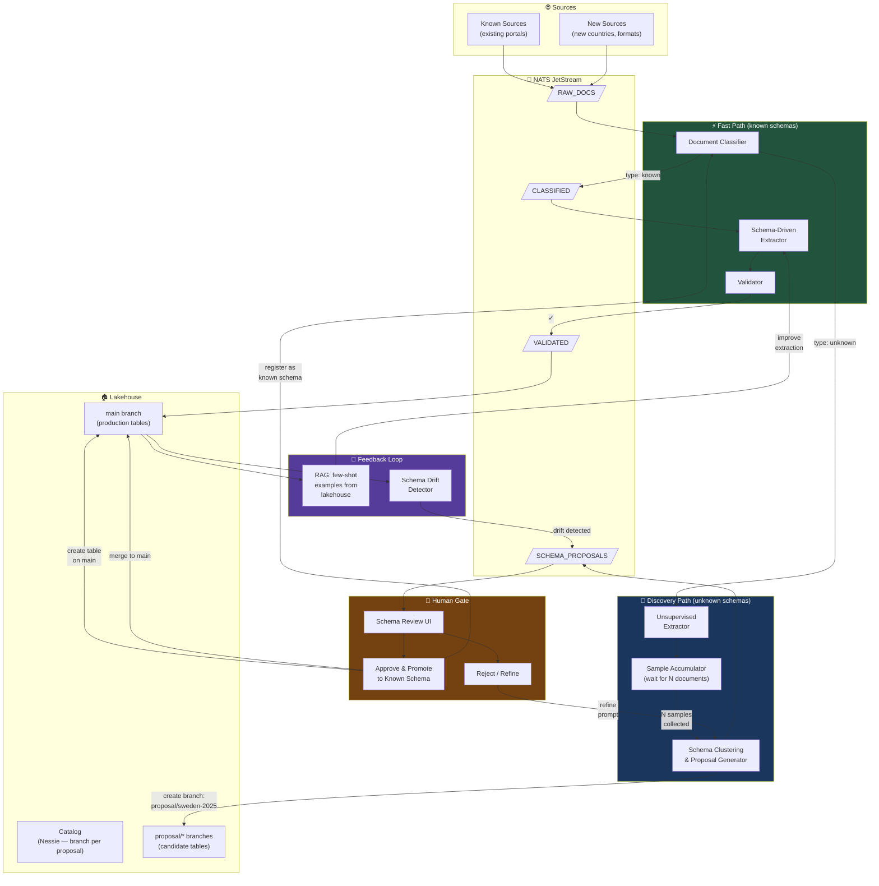
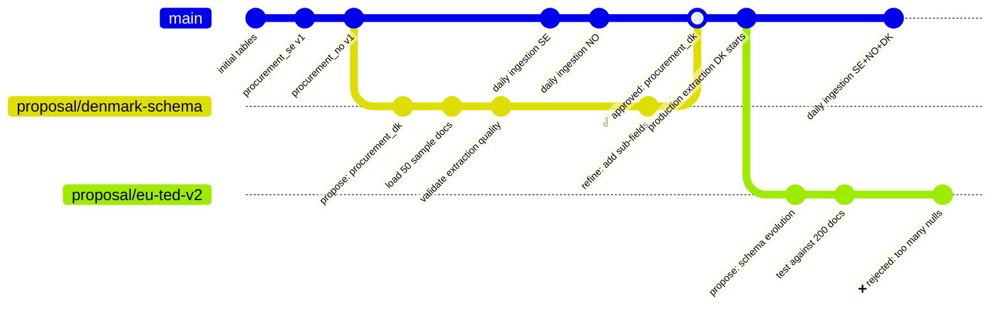
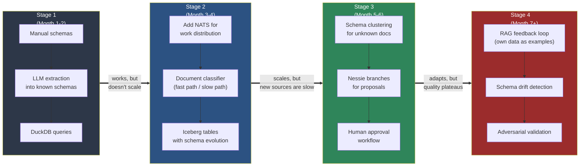

# Alternative B — Progressive Schema Discovery (The Hybrid)

> Start schema-first for known sources, let the system propose 
> schemas for unknown ones. Human approves before anything hits 
> the lakehouse. Best of both worlds.

## Architecture

## Nessie Branch Workflow for Schema Proposals

## The Evolution Path — From Simple to Self-Organizing

