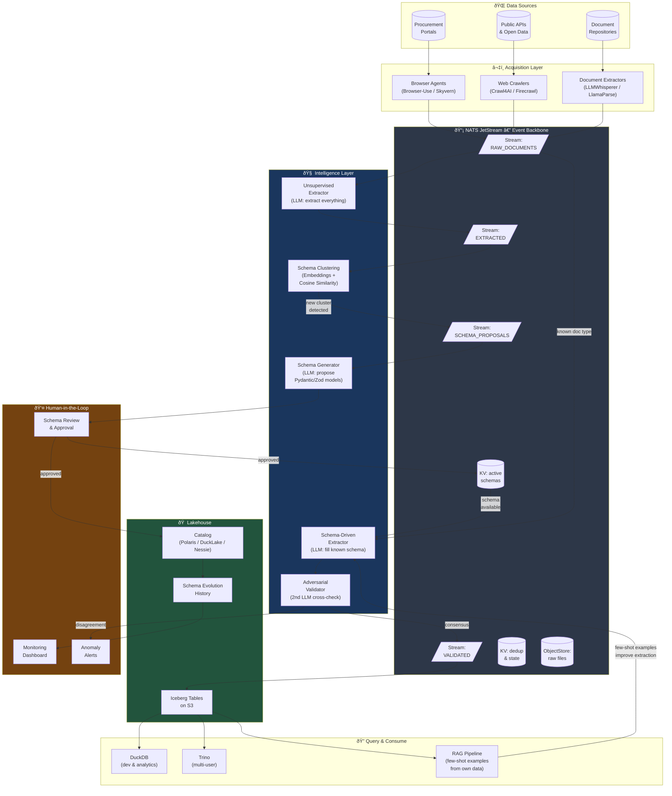
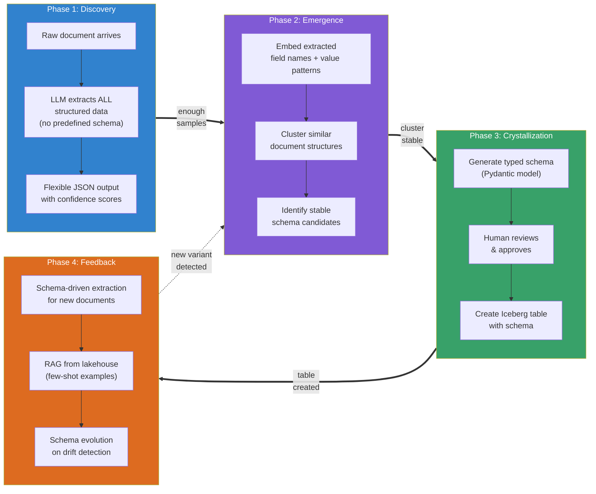
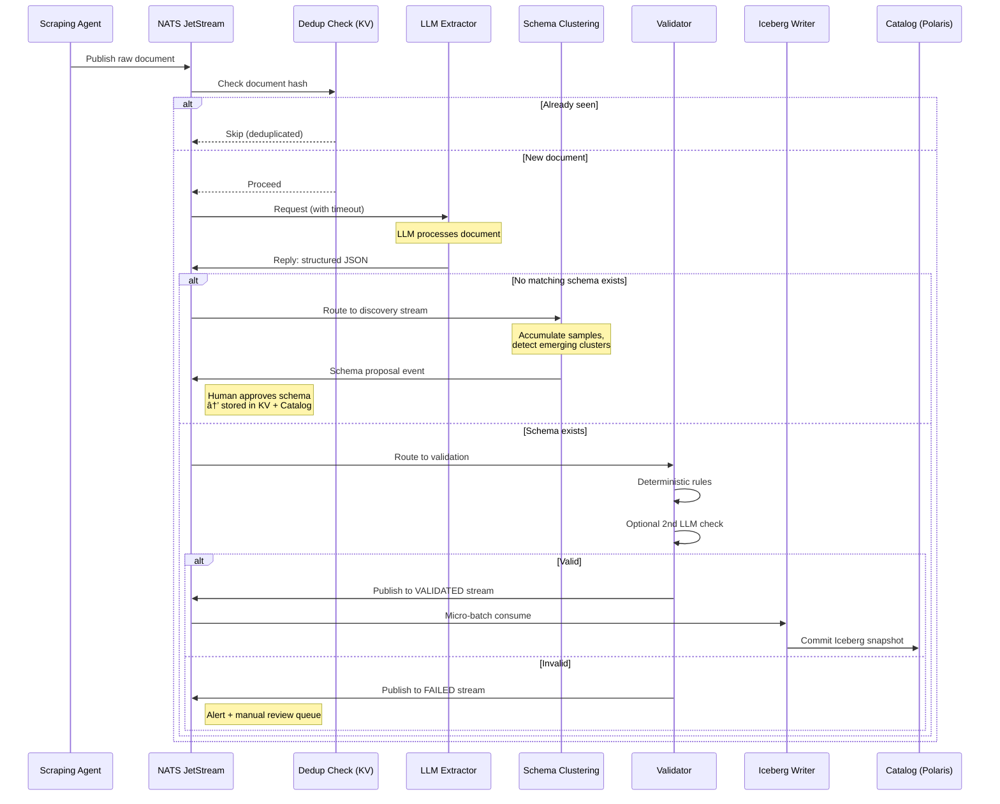

# Self-Organizing Data Pipeline — The Full Vision

## High-Level Architecture

```mermaid
graph TB
    subgraph Sources["🌠Data Sources"]
        WEB[("Procurement\nPortals")]
        PDF[("Document\nRepositories")]
        API[("Public APIs\n& Open Data")]
    end

    subgraph Acquisition["â¬‡ï¸ Acquisition Layer"]
        BA["Browser Agents\n(Browser-Use / Skyvern)"]
        FC["Web Crawlers\n(Crawl4AI / Firecrawl)"]
        DE["Document Extractors\n(LLMWhisperer / LlamaParse)"]
    end

    subgraph NATS["📡 NATS JetStream — Event Backbone"]
        direction LR
        S1[/"Stream:\nRAW_DOCUMENTS"/]
        S2[/"Stream:\nEXTRACTED"/]
        S3[/"Stream:\nSCHEMA_PROPOSALS"/]
        S4[/"Stream:\nVALIDATED"/]
        KV1[("KV: dedup\n& state")]
        KV2[("KV: active\nschemas")]
        OBJ[("ObjectStore:\nraw files")]
    end

    subgraph Intelligence["🧠 Intelligence Layer"]
        direction TB
        UE["Unsupervised\nExtractor\n(LLM: extract everything)"]
        SC["Schema Clustering\n(Embeddings +\nCosine Similarity)"]
        SG["Schema Generator\n(LLM: propose\nPydantic/Zod models)"]
        SE["Schema-Driven\nExtractor\n(LLM: fill known schema)"]
        AV["Adversarial\nValidator\n(2nd LLM cross-check)"]
    end

    subgraph Lakehouse["🠠Lakehouse"]
        direction TB
        CAT["Catalog\n(Polaris / DuckLake / Nessie)"]
        ICE["Iceberg Tables\non S3"]
        META["Schema Evolution\nHistory"]
    end

    subgraph Query["🔠Query & Consume"]
        DDB["DuckDB\n(dev & analytics)"]
        TRI["Trino\n(multi-user)"]
        RAG["RAG Pipeline\n(few-shot examples\nfrom own data)"]
    end

    subgraph Human["👤 Human-in-the-Loop"]
        REV["Schema Review\n& Approval"]
        DASH["Monitoring\nDashboard"]
        ALERT["Anomaly\nAlerts"]
    end

    %% Flow
    WEB --> BA
    PDF --> DE
    API --> FC
    BA --> S1
    FC --> S1
    DE --> S1

    S1 --> UE
    UE --> S2
    S2 --> SC

    SC -->|"new cluster\ndetected"| S3
    S3 --> SG
    SG --> REV
    REV -->|"approved"| KV2
    REV -->|"approved"| CAT

    KV2 -->|"schema\navailable"| SE
    S1 -->|"known doc type"| SE
    SE --> AV
    AV -->|"consensus"| S4
    AV -->|"disagreement"| ALERT
    S4 --> ICE

    ICE --> DDB
    ICE --> TRI
    ICE --> RAG
    RAG -->|"few-shot examples\nimprove extraction"| SE
    CAT --> META
    META --> DASH

    style NATS fill:#2d3748,color:#fff
    style Intelligence fill:#1a365d,color:#fff
    style Lakehouse fill:#22543d,color:#fff
    style Human fill:#744210,color:#fff
```

## The Four Phases in Detail

```mermaid
graph LR
    subgraph P1["Phase 1: Discovery"]
        direction TB
        D1["Raw document arrives"]
        D2["LLM extracts ALL\nstructured data\n(no predefined schema)"]
        D3["Flexible JSON output\nwith confidence scores"]
        D1 --> D2 --> D3
    end

    subgraph P2["Phase 2: Emergence"]
        direction TB
        E1["Embed extracted\nfield names + value patterns"]
        E2["Cluster similar\ndocument structures"]
        E3["Identify stable\nschema candidates"]
        E1 --> E2 --> E3
    end

    subgraph P3["Phase 3: Crystallization"]
        direction TB
        C1["Generate typed schema\n(Pydantic model)"]
        C2["Human reviews\n& approves"]
        C3["Create Iceberg table\nwith schema"]
        C1 --> C2 --> C3
    end

    subgraph P4["Phase 4: Feedback"]
        direction TB
        F1["Schema-driven extraction\nfor new documents"]
        F2["RAG from lakehouse\n(few-shot examples)"]
        F3["Schema evolution\non drift detection"]
        F1 --> F2 --> F3
    end

    P1 ==>|"enough\nsamples"| P2
    P2 ==>|"cluster\nstable"| P3
    P3 ==>|"table\ncreated"| P4
    P4 -.->|"new variant\ndetected"| P2

    style P1 fill:#3182ce,color:#fff
    style P2 fill:#805ad5,color:#fff
    style P3 fill:#38a169,color:#fff
    style P4 fill:#dd6b20,color:#fff
```

## NATS Event Flow Detail

```mermaid
sequenceDiagram
    participant Scraper as Scraping Agent
    participant NATS as NATS JetStream
    participant Dedup as Dedup Check (KV)
    participant Extract as LLM Extractor
    participant Cluster as Schema Clustering
    participant Validate as Validator
    participant Writer as Iceberg Writer
    participant Catalog as Catalog (Polaris)

    Scraper->>NATS: Publish raw document
    NATS->>Dedup: Check document hash
    alt Already seen
        Dedup-->>NATS: Skip (deduplicated)
    else New document
        Dedup-->>NATS: Proceed
        NATS->>Extract: Request (with timeout)
        Note over Extract: LLM processes document
        Extract->>NATS: Reply: structured JSON

        alt No matching schema exists
            NATS->>Cluster: Route to discovery stream
            Note over Cluster: Accumulate samples,<br/>detect emerging clusters
            Cluster->>NATS: Schema proposal event
            Note right of NATS: Human approves schema<br/>→ stored in KV + Catalog
        else Schema exists
            NATS->>Validate: Route to validation
            Validate->>Validate: Deterministic rules
            Validate->>Validate: Optional 2nd LLM check
            alt Valid
                Validate->>NATS: Publish to VALIDATED stream
                NATS->>Writer: Micro-batch consume
                Writer->>Catalog: Commit Iceberg snapshot
            else Invalid
                Validate->>NATS: Publish to FAILED stream
                Note right of NATS: Alert + manual review queue
            end
        end
    end
```
