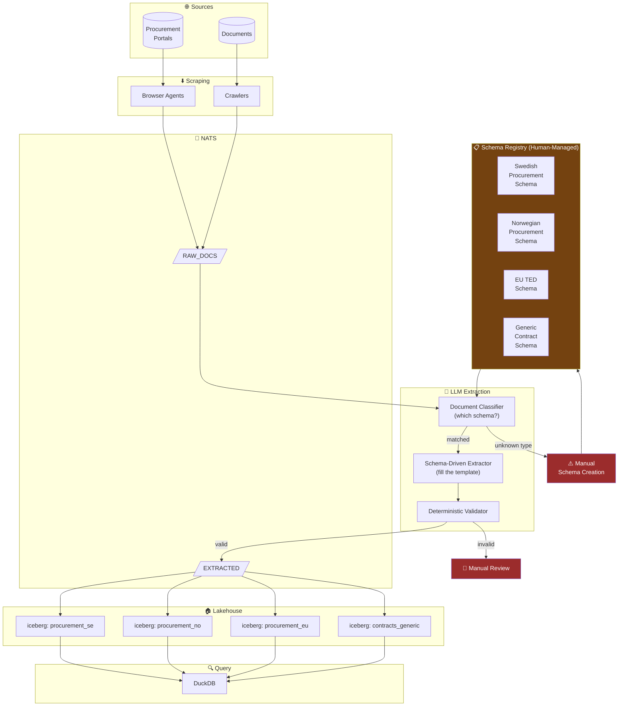

# Alternative A — Schema-First with LLM Enhancement

> The pragmatic approach: humans define schemas, LLMs fill them, 
> the system just gets better at filling over time.
> Lower risk, lower reward. The safe starting point.

## Architecture



## Comparison with Self-Organizing Approach

```
┌─────────────────────────┬──────────────────────┬──────────────────────┐
│                         │ Schema-First (this)  │ Self-Organizing      │
├─────────────────────────┼──────────────────────┼──────────────────────┤
│ New source onboarding   │ Days (human defines  │ Hours (system        │
│                         │ schema first)        │ discovers schema)    │
├─────────────────────────┼──────────────────────┼──────────────────────┤
│ Schema quality          │ High (human-crafted) │ Variable (emergent)  │
├─────────────────────────┼──────────────────────┼──────────────────────┤
│ Handles surprises       │ Poorly (unknown docs │ Well (clusters new   │
│                         │ fail or get generic) │ patterns naturally)  │
├─────────────────────────┼──────────────────────┼──────────────────────┤
│ Operational complexity  │ Low                  │ High                 │
├─────────────────────────┼──────────────────────┼──────────────────────┤
│ Trust / auditability    │ High (schemas are    │ Lower (schemas are   │
│                         │ explicit contracts)  │ derived, need review)│
├─────────────────────────┼──────────────────────┼──────────────────────┤
│ Scales to new countries │ Linearly (each needs │ Sub-linearly (system │
│                         │ manual schema work)  │ reuses patterns)     │
├─────────────────────────┼──────────────────────┼──────────────────────┤
│ Best for                │ Known, stable sources│ Diverse, evolving    │
│                         │ with clear structure │ sources at scale     │
└─────────────────────────┴──────────────────────┴──────────────────────┘
```
