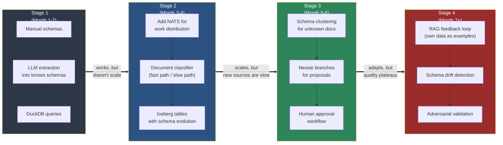

# Alternative B — Progressive Schema Discovery (The Hybrid)

> Start schema-first for known sources, let the system propose 
> schemas for unknown ones. Human approves before anything hits 
> the lakehouse. Best of both worlds.

## Architecture

```mermaid
graph TB
    subgraph Sources["🌐 Sources"]
        KNOWN["Known Sources\n(existing portals)"]
        NEW["New Sources\n(new countries, formats)"]
    end

    subgraph NATS["📡 NATS JetStream"]
        RAW[/"RAW_DOCS"/]
        CLASSIFIED[/"CLASSIFIED"/]
        PROPOSED[/"SCHEMA_PROPOSALS"/]
        VALIDATED[/"VALIDATED"/]
    end

    subgraph FastPath["⚡ Fast Path (known schemas)"]
        CLS["Document Classifier"]
        EXT_K["Schema-Driven\nExtractor"]
        VAL_K["Validator"]
    end

    subgraph SlowPath["🔬 Discovery Path (unknown schemas)"]
        EXT_U["Unsupervised\nExtractor"]
        ACC["Sample Accumulator\n(wait for N documents)"]
        CLUST["Schema Clustering\n& Proposal Generator"]
    end

    subgraph Approval["👤 Human Gate"]
        REVIEW["Schema Review UI"]
        APPROVE["Approve & Promote\nto Known Schema"]
        REJECT["Reject / Refine"]
    end

    subgraph Lakehouse["🏠 Lakehouse"]
        CATALOG["Catalog\n(Nessie — branch per proposal)"]
        MAIN["main branch\n(production tables)"]
        BRANCH["proposal/* branches\n(candidate tables)"]
    end

    subgraph Feedback["🔄 Feedback Loop"]
        RAG["RAG: few-shot\nexamples from\nlakehouse"]
        DRIFT["Schema Drift\nDetector"]
    end

    KNOWN --> RAW
    NEW --> RAW

    RAW --> CLS

    CLS -->|"type: known"| CLASSIFIED
    CLS -->|"type: unknown"| EXT_U

    CLASSIFIED --> EXT_K
    EXT_K --> VAL_K
    VAL_K -->|"✓"| VALIDATED
    VALIDATED --> MAIN

    EXT_U --> ACC
    ACC -->|"N samples\ncollected"| CLUST
    CLUST --> PROPOSED
    PROPOSED --> REVIEW

    REVIEW --> APPROVE
    REVIEW --> REJECT
    APPROVE -->|"create table\non main"| MAIN
    APPROVE -->|"register as\nknown schema"| CLS
    REJECT -->|"refine\nprompt"| CLUST

    %% Nessie branching
    CLUST -->|"create branch:\nproposal/sweden-2025"| BRANCH
    APPROVE -->|"merge to main"| MAIN

    %% Feedback
    MAIN --> RAG
    RAG -->|"improve\nextraction"| EXT_K
    MAIN --> DRIFT
    DRIFT -->|"drift detected"| PROPOSED

    style FastPath fill:#22543d,color:#fff
    style SlowPath fill:#1a365d,color:#fff
    style Approval fill:#744210,color:#fff
    style Feedback fill:#553c9a,color:#fff
```

## Nessie Branch Workflow for Schema Proposals

```mermaid
gitGraph
    commit id: "initial tables"
    commit id: "procurement_se v1"
    commit id: "procurement_no v1"

    branch proposal/denmark-schema
    commit id: "propose: procurement_dk"
    commit id: "load 50 sample docs"
    commit id: "validate extraction quality"

    checkout main
    commit id: "daily ingestion SE"
    commit id: "daily ingestion NO"

    checkout proposal/denmark-schema
    commit id: "refine: add sub-fields"

    checkout main
    merge proposal/denmark-schema id: "✅ approved: procurement_dk"
    commit id: "production extraction DK starts"

    branch proposal/eu-ted-v2
    commit id: "propose: schema evolution"
    commit id: "test against 200 docs"

    checkout main
    commit id: "daily ingestion SE+NO+DK"

    checkout proposal/eu-ted-v2
    commit id: "❌ rejected: too many nulls"
```

## The Evolution Path — From Simple to Self-Organizing

