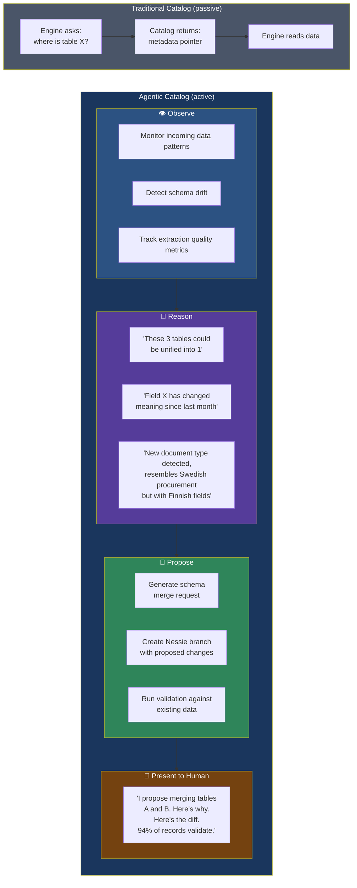
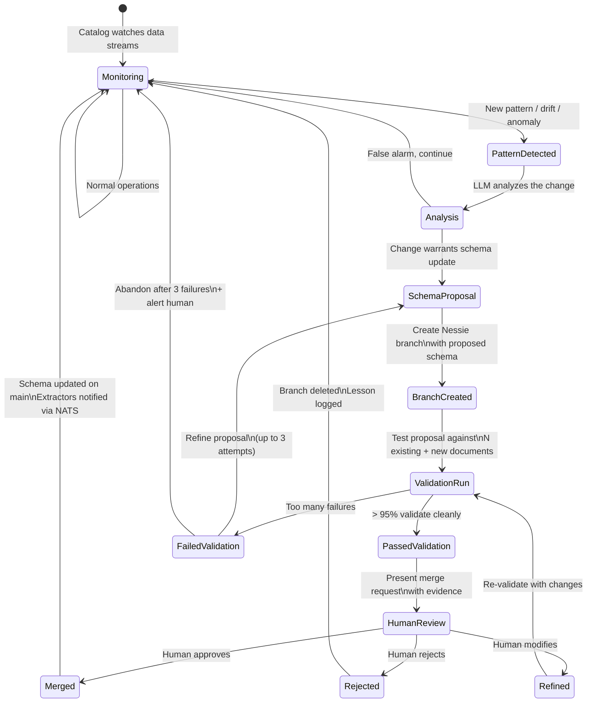
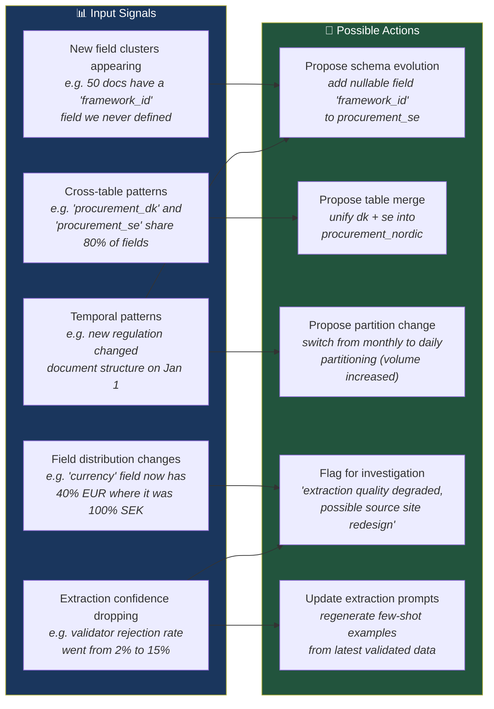
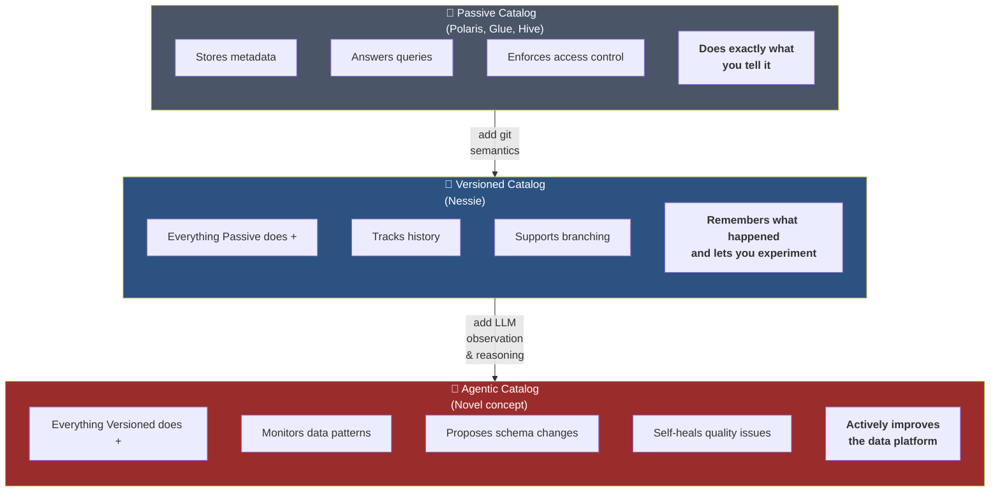

# The Agentic Catalog — The Novel Idea

> What if the catalog wasn't just a metadata store, 
> but an intelligent agent that proposes, validates, 
> and evolves schemas autonomously?

## Concept



## The Agentic Catalog Loop



## What the Agentic Catalog "Sees"



## Contrast: Three Catalog Philosophies



## Implementation Sketch

```
The agentic catalog is not a new catalog implementation.
It's an LLM agent LAYER that sits on top of Nessie and
uses the existing catalog APIs to observe and act.

┌───────────────────────────────────────────────────┐
│              Agentic Catalog Agent                 │
│                                                   │
│  ┌─────────────┐  ┌──────────┐  ┌─────────────┐  │
│  │  Observer    │  │ Reasoner │  │ Proposer    │  │
│  │             │  │          │  │             │  │
│  │ - subscribes│  │ - Claude │  │ - creates   │  │
│  │   to NATS   │  │   API    │  │   Nessie    │  │
│  │   streams   │  │ - prompt │  │   branches  │  │
│  │ - queries   │  │   chain  │  │ - runs      │  │
│  │   DuckDB    │  │   with   │  │   validation│  │
│  │   for stats │  │   context│  │ - formats   │  │
│  │ - tracks    │  │   from   │  │   merge     │  │
│  │   quality   │  │   lake-  │  │   request   │  │
│  │   metrics   │  │   house  │  │   for human │  │
│  └──────┬──────┘  └────┬─────┘  └──────┬──────┘  │
│         │              │               │          │
│         ▼              ▼               ▼          │
│  ┌─────────────────────────────────────────────┐  │
│  │         Standard APIs (nothing custom)       │  │
│  │  NATS subscribe │ Nessie REST │ DuckDB SQL  │  │
│  └─────────────────────────────────────────────┘  │
└───────────────────────────────────────────────────┘

This is the key: no custom catalog needed.
Just an agent that uses existing tools intelligently.
```
