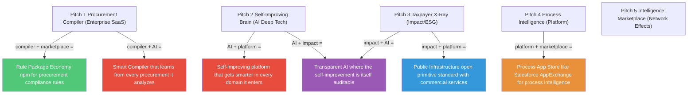
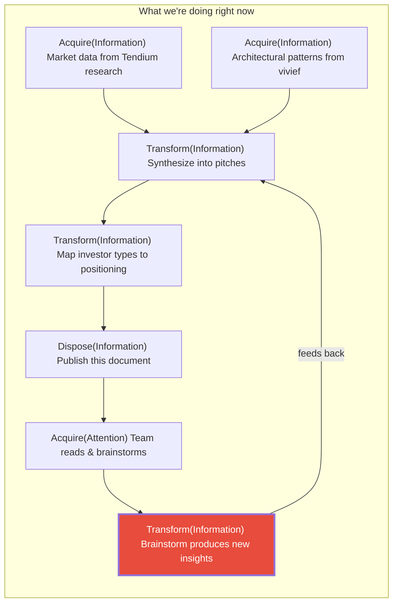

# Procurement Primitives — Investor Elevator Pitches

**A brainstorming document for exploring how to position procurement primitives**

*Ingredients: Tendium market knowledge, vivief effect architecture, procurement MVP, procurement primitives model*

---

## The Ingredients We're Cooking With

Before the pitches, let's name what we're combining — so we can remix freely:

| Ingredient | What it gives us |
|-----------|-----------------|
| **Tendium / Market** | 800B+ SEK Swedish public procurement market. 17,000+ tenders/year. No national database — fragmented across private notice companies. Mercell dominates (acquired for 2B SEK). Current AI players extract documents but don't *understand* procurement as a process. 96% supplier dissatisfaction. |
| **vivief / Architecture** | `(State, Effect) → (State', [Effect'])` as universal pattern. Rules that lift low-level observations into high-level understanding. Diagnostics loop. Self-improving systems. Already proven on code intelligence. |
| **Procurement MVP** | DuckLake + NATS + Ollama on a laptop. Effect-driven pipeline: Acquire → Extract → Validate → Load. Schema-driven extraction with Pydantic. YAML rules engine with diagnostic output. Teacher-student LLM distillation. |
| **Procurement Primitives** | 5 What-types (Matter, Energy, Information, Attention, Rights) × 4 Directions (Acquire, Dispose, Move, Transform). Compound procurements as graphs. Customer journey as recursive effect chains. Boundary failures as highest-value diagnostics. |

---

## Pitch 1: The Procurement Compiler

**Target investor:** Enterprise SaaS / GovTech investor (think Thoma Bravo, who bought Mercell)

**The pitch:**

> Every procurement in the world is a program. It has inputs, outputs, expected behavior, and bugs. Today's procurement software is like editing code in Notepad — it stores documents but understands nothing about the process.
>
> We built a procurement compiler. It decomposes any procurement into atomic primitives — what's being acquired, moved, transformed, and by whom — then applies diagnostic rules the way a code compiler catches bugs before they ship. Missing evaluation criteria? That's a type error. Supplier who's also the evaluator? That's a circular dependency. Contract awarded without a tender period? That's a missing required field.
>
> Sweden alone has 800 billion SEK in annual public procurement with no national database. Mercell was acquired for 2 billion SEK and they're still a document storage system. We don't store documents — we compile procurement processes and report the bugs.

**Why this investor, why this pitch:**

Enterprise SaaS / GovTech investors understand that the procurement market is enormous, fragmented, and ripe for a platform shift. Thoma Bravo bought Mercell precisely because procurement is sticky, subscription-based, and regulation-driven. But Mercell is a legacy document platform built through acquisitions. This pitch positions us as the *next generation* — the thing that replaces Mercell the way IDEs replaced text editors. The "compiler" metaphor lands with technical investors who've seen this pattern in DevTools (JetBrains, Snyk, Datadog) and can map it to a new vertical. The moat is the rule engine and the primitive model, not the data scraping — which is commoditizing fast.

---

## Pitch 2: The Self-Improving Procurement Brain

**Target investor:** AI-native / deep tech VC (think Sequoia AI fund, or European equivalents like EQT Ventures)

**The pitch:**

> Current procurement AI extracts text from PDFs. That's yesterday's problem — every LLM can do it. The real problem is understanding what a procurement *means*, detecting when it's going wrong, and getting smarter every time.
>
> We built a system where procurement analysis improves itself. Documents flow through an effect pipeline: acquire, extract, validate, diagnose. Every diagnostic — "this tender is missing an evaluation period" — feeds back into the rule engine. Rules that fire often become training data for smaller, cheaper models. The expensive LLM teaches the cheap model what to look for. Over time, the system needs less AI to catch more problems.
>
> The recursive part: our system tracks its own operations as procurement events — using the same primitives it uses to analyze customer data. We literally dogfood our own intelligence loop. That's not a gimmick, it's an architectural advantage: every feature we build for customers automatically becomes a feature we use to improve ourselves.

**Why this investor, why this pitch:**

AI-native VCs are drowning in "we use GPT to do X" pitches. They're looking for *defensible AI* — systems where the AI gets better with usage, creating a data flywheel. The teacher-student distillation loop (expensive LLM trains cheaper model) is a concrete cost-moat story: our unit economics improve with scale while competitors stay on the API-cost treadmill. The self-referential architecture is genuinely novel and shows deep technical thinking, which signals a team that won't get commoditized. The vivief pedigree (effect systems from code intelligence) shows this isn't a weekend project — it's a framework that's been battle-tested in another domain and is now applied to procurement.

---

## Pitch 3: The Procurement X-Ray for Every Taxpayer's Money

**Target investor:** Impact / ESG investor, or Nordic public-sector-adjacent fund (think Vinnova Innovation grants, EIF, or Nordic Impact Investing)

**The pitch:**

> In Sweden, 20% of GDP flows through public procurement — 800 billion kronor of taxpayer money, every year. There is no national database. No one can tell you, for any given procurement, whether the process was followed correctly, whether the best bid won, or whether public money was well spent.
>
> We built a procurement X-ray. It takes the messy reality of procurement documents — tenders, bids, evaluations, contracts scattered across dozens of private platforms — and decomposes them into five primitive types: what was acquired, what was moved, what was transformed, what attention was engaged, what rights were transferred. Then it reassembles the full picture and tells you what's missing, what's suspicious, and what's working well.
>
> The first customer is transparency. The second customer is efficiency. The third customer is every supplier who's tired of losing bids they should have won because the process was opaque. 96% of Swedish suppliers say the current system doesn't work. We agree — and we can prove exactly where it breaks, for every single procurement.

**Why this investor, why this pitch:**

Impact investors need a clear theory of change: public money → better oversight → societal benefit. This pitch gives them that in a measurable way. The 20%-of-GDP number is staggering and the fragmentation problem (no national database) is a genuine market failure that the private sector hasn't solved because incumbents profit from the opacity. The primitive decomposition gives a concrete, explainable mechanism — not "AI magic" but "we categorize what actually happened and compare it to what should have happened." Nordic investors particularly resonate with the public-sector angle because the Nordics have high public spending and high expectations of transparency. This also opens doors to EU procurement directives (Directive 2014/24/EU) as a regulatory tailwind.

---

## Pitch 4: The Universal Process Intelligence Engine

**Target investor:** Platform / horizontal SaaS investor (think Insight Partners, Index Ventures — investors in Datadog, Notion, Figma)

**The pitch:**

> We discovered something building code analysis tools: the pattern `(State, Effect) → (New State, Side Effects)` doesn't just describe software — it describes any process where things flow between parties. We proved it on code. Now we're proving it on procurement. Next is supply chain, compliance, legal, healthcare workflows — any domain where documents represent process steps and rules determine correctness.
>
> Procurement is our beachhead because it's huge, broken, and has a clear buyer. But what we actually built is a *process intelligence engine* — five primitives (Matter, Information, Energy, Attention, Rights) crossed with four directions (Acquire, Dispose, Move, Transform) that decompose any multi-party process into analyzable atoms. Add domain-specific rules, and you get a diagnostic system that catches process failures the way a compiler catches code bugs.
>
> The play: own the procurement vertical (800B+ SEK in Sweden, €2 trillion in the EU), prove the engine, then expand the primitive model into adjacent verticals. Same engine, different rule packages. Like how Datadog started with infrastructure monitoring and expanded into APM, logs, and security — same platform, different signals.

**Why this investor, why this pitch:**

Platform investors look for *wedge + expand* stories. They want to see a focused entry point (procurement) with a credible path to becoming a horizontal platform (process intelligence). The vivief origin story is crucial here — it proves the architecture generalizes, because it already works in a completely different domain (code analysis). The Datadog comparison is deliberate: Datadog's insight was that observability is one problem with many signals. Our insight is that process intelligence is one problem with many domains. The 5×4 primitive matrix is the kind of clean abstraction that platform investors love because it implies a systematic expansion path, not ad-hoc feature additions. The rule-package model (like ESLint plugins or Datadog integrations) creates a potential ecosystem play.

---

## Pitch 5: The Procurement Intelligence Marketplace

**Target investor:** Marketplace / network-effects investor (think a16z marketplace fund, or Nordic equivalents like Creandum)

**The pitch:**

> Every procurement creates a chain of effects: a need triggers research, research triggers evaluation, evaluation triggers a decision, a decision triggers acquisition, acquisition triggers delivery. Today these chains are invisible — locked in email threads, PDF attachments, and institutional knowledge.
>
> We make the chains visible, analyzable, and tradeable. Our platform decomposes procurement into atomic primitives and tracks them across the entire lifecycle. This creates three marketplace opportunities:
>
> First, an *insight marketplace*: organizations that have solved a procurement challenge (found reliable suppliers, optimized evaluation criteria, navigated regulatory requirements) can package their rules and sell them. Like npm packages but for procurement intelligence.
>
> Second, a *capability marketplace*: the atomic decomposition reveals exactly what capability a procurement needs. "This tender requires Transform(Information) expertise in environmental impact assessment" — match that to qualified evaluators, consultants, or AI services.
>
> Third, a *benchmark marketplace*: with enough procurement atoms flowing through the system, we can tell any organization how their procurement DNA compares to their peers. "Your average Acquire(Matter) cycle is 47 days; your industry median is 23. Here's what the fast organizations do differently."
>
> The self-referential insight: using the marketplace is itself a procurement — Acquire(Information) about how to procure better. The platform's own growth feeds its own intelligence loop.

**Why this investor, why this pitch:**

Marketplace investors look for network effects and liquidity. This pitch gives them three: rules get better as more organizations contribute (content network effect), capability matching improves with more participants on both sides (classic two-sided marketplace), and benchmarks become more valuable with more data (data network effect). The atomic decomposition is the key unlock — you can't build a marketplace on opaque blob-documents, but you *can* build one on standardized primitives. It's the difference between trying to build an app store for arbitrary software vs. building one for apps that all use the same APIs. The recursive element (using the marketplace improves procurement which generates more marketplace activity) is the kind of flywheel story that gets a16z excited. The risk acknowledgment is that this is a Phase 3 vision — you need critical mass first — which is why procurement in Sweden/Nordics is the starting point: concentrated market, high regulatory pressure, and a real problem that creates the initial liquidity.

---

## Brainstorming Space: Mixing and Matching

The pitches above aren't mutually exclusive — they're lenses on the same underlying system. Here's where the real fun begins:

### What if we combine pitches?

### The investor-stage mapping

Not every pitch fits every stage. Here's how they sequence:

| Stage | Best pitch | Why | Money range |
|-------|-----------|-----|-------------|
| **Pre-seed / Angel** | Pitch 2 (Self-improving AI) | Technical founders with a novel architecture. Angels bet on teams and insight. | €200K–500K |
| **Seed** | Pitch 1 (Compiler) + Pitch 3 (Impact) | Working MVP + clear market. Need to show the primitive model works on real data. | €1M–3M |
| **Series A** | Pitch 4 (Platform) | Proven in procurement, showing signals of generalization. Revenue from first vertical. | €5M–15M |
| **Series B** | Pitch 5 (Marketplace) | Network effects visible in data. Rule packages being created by customers. | €15M–40M |
| **Growth** | Pitch 4 + 5 combined | Multi-vertical platform with marketplace dynamics. The Datadog/Salesforce comparison becomes credible. | €40M+ |

### What Tendium teaches us (and where we diverge)

Tendium is the closest existing company to what we're describing. Here's what we learn from them:

**What Tendium got right:**
- AI-first from day one (vs. Mercell's acquisition-driven growth)
- Supplier-side focus (where the pain is acute)
- Scandinavian payment data aggregation (Tendium Intelligence) — data as moat
- The mission resonates: modernizing a broken process

**Where Tendium is stuck:**
- Still fundamentally a document-level tool: find tenders, extract text, write bids
- No process-level understanding: can't tell you *why* a procurement went wrong
- No self-improving architecture: AI costs stay flat or grow with usage
- Competing on features, not on a fundamentally different model
- ~36M SEK revenue with -24M result — burning cash without a clear path to the moat

**Where procurement primitives diverge:**
- We don't compete with Tendium — we *could power* Tendium (and every other procurement tool)
- We operate at the *atomic* level, not the document level
- Our rules engine is domain-agnostic — procurement is the first domain, not the only one
- The self-referential loop means our cost per insight decreases with scale
- We create a *vocabulary* (the 5×4 matrix) that becomes an industry standard if adopted

### The recursive brainstorm: what insights are we procuring right now?

This document is itself a compound procurement:

The side effects of this brainstorm might include:

- A new pitch we haven't thought of yet
- A realization that one of the primitives is wrong or missing
- A customer segment nobody mentioned
- A technical insight about the architecture
- A decision to actually build this
- A decision to pitch this to Tendium as their next-gen architecture

All of which are themselves procurements. 🔄

---

## Open Provocations

Things worth arguing about over coffee (or stronger drinks):

**On the primitives:**
- Is "Trust" a 6th primitive? You can't procure it directly, but every procurement depends on it. Maybe Trust is the *currency* that all primitives trade in.
- Is "Energy" really separate from "Matter"? In procurement terms, buying electricity and buying diesel might be different enough to matter. Or maybe Energy is just Matter-in-motion.
- Should "Create" be a 5th direction? Manufacturing is Transform, but what about genuine invention — creating something that didn't exist before?

**On the market:**
- Is the right entry point Sweden (small, concentrated, transparent) or EU (massive, regulated, fragmented)?
- Should we sell to procurement *buyers* (public agencies) or *suppliers* (companies bidding)? Tendium chose suppliers. Mercell chose buyers. We could choose the *process itself*.
- Is this a startup or an open standard? What if the 5×4 matrix becomes a public specification and we monetize the tooling?

**On the architecture:**
- Can we actually run the MVP on real Swedish procurement data and produce diagnostics that surprise a domain expert?
- What's the smallest possible demo that makes an investor say "I've never seen procurement analyzed this way"?
- Could we ship the rule engine as an open-source tool and build the business on hosted intelligence?

**On the recursive fun:**
- If procurement experts use our system to gain insights about procurement, and those insights improve the system, how many iterations until the system knows more about procurement than any human expert?
- Can we record the brainstorming session itself as a procurement event log and run our own diagnostics on it?
- What if every customer's procurement data, anonymized and atomized into primitives, creates a collective intelligence about how procurement *actually works* across industries?

---

*Pick any thread. Pull it. See what unravels. That's the procurement of insight.*
