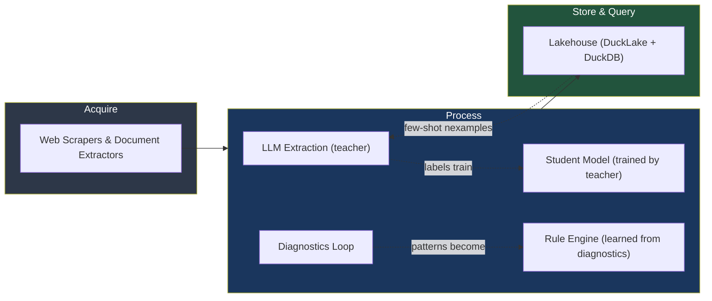

# Intelligent Data Extraction at Scale
### Executive Summary for Technical Leadership

---

## The Opportunity

Organizations that extract structured data from documents and web sources face a fundamental tension: **generative AI models (LLMs) are flexible but expensive and non-deterministic, while traditional ML models are fast and cheap but brittle and expensive to set up.** The teams that solve this are the ones that use the former to bootstrap the latter — and build a system that gets cheaper and better simultaneously.

This document outlines an architecture that does exactly that, using procurement as the primary domain but designed to generalize to any domain where structured data must be extracted from diverse, evolving sources.

## Core Insight

Modern LLM-powered extraction has matured enough to replace hand-coded scrapers, but most implementations stop at "call the LLM for every document." The real leverage comes from three ideas working together:

**1. Teacher-Student Distillation** — Use expensive LLMs (Claude, GPT-4o) to label data, then train cheap, fast models that handle 90%+ of production volume. The LLM becomes a bootstrapping tool, not a runtime dependency.

**2. Effect-Based Pipeline Architecture** — Model every pipeline step as a state transformation that emits typed effects. This gives you composability, traceability, and a natural mapping to event-driven infrastructure (NATS). It also lets you model the *domain itself* (procurement processes, contract lifecycles) using the same formalism as the pipeline.

**3. Self-Correcting Diagnostics Loop** — When extraction or validation fails, produce structured diagnostics that the LLM can act on — not just "try again" but "here's specifically what went wrong." Recurring diagnostic patterns automatically become either rules (if structural) or training data (if they need ML).

## What This Enables

```
Day 1:      Point the system at a new data source.
            LLM extracts everything. Expensive but works immediately.

Week 2-4:   Enough labeled data accumulated.
            Train a student model. 90% of traffic moves off the LLM.
            Cost drops 100x for those documents.

Month 2+:   Recurring errors have become automated rules.
            Student model handles routine extraction.
            LLM only handles edge cases and new document types.
            System proposes schema changes when data patterns shift.

Ongoing:    New source added → system discovers the schema → 
            human approves → extraction begins.
            No manual scraper development.
```

## Architecture at a Glance



## Key Technology Choices

| Layer | Choice | Why |
|-------|--------|-----|
| Messaging | NATS JetStream | Single binary, request-reply for LLM calls, KV for state, minimal ops |
| Extraction | Claude/GPT + Ollama (local) | Cloud LLMs for quality, local for volume |
| Validation | Pydantic + declarative rules | Type-safe schemas, composable rule packages |
| Storage | DuckLake + DuckDB | SQL-native lakehouse, zero infrastructure on laptop, PostgreSQL+S3 in production |
| Scraping | Crawl4AI, Browser-Use, Jina Reader | LLM-powered, semantic not structural |

## Why Now

Three things converged in the past 12 months that make this viable where it wasn't before:

- **Structured output from LLMs** (JSON mode, Pydantic schemas) makes extraction reliable enough to generate training data.
- **Local LLMs via Ollama** (Llama, Qwen) make the student-model tier nearly free to run.
- **DuckLake** (released May 2025) eliminates the infrastructure complexity of a lakehouse — you can run the full stack on a laptop.

## Discussion Points

1. Where does this architecture overlap with or complement what the team has built?
2. Which data sources would be the best first test case?
3. What validation rules does the team already maintain that could become the first rule package?
4. Is the teacher-student distillation path attractive given current LLM costs vs. extraction volume?

---

*This summary is part of a three-document set. See also: Vision Document (conceptual framework) and Implementation Architecture (MVP specification).*
