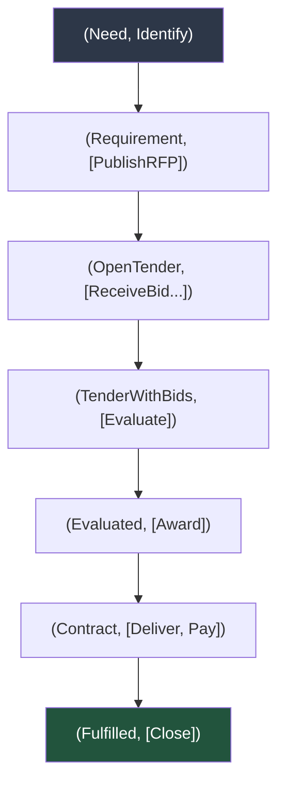

# Data Extraction as an Effect System
### A Vision for Self-Improving Structured Data Pipelines

---

## 1. The Pattern: State, Effect, Transformation

There is a simple formalism that unifies data extraction pipelines, domain modeling, schema evolution, and rule engines into a single coherent framework:

```
(State, Effect) → (State', [Effect'])
```

A **state** and an **effect** go in. A new **state** and zero or more new **effects** come out. Every step in a pipeline, every event in a business process, and every schema change follows this shape.

This isn't just notation — it's an architectural principle. When you build systems around this pattern, you get composability (chain any steps), traceability (every state change has a cause), and a natural mapping to event-driven infrastructure where effects become messages.

## 2. The Extraction Pipeline as Effects

A document extraction pipeline is a sequence of state transformations:

```mermaid
graph LR
    A["(RawDoc, Scrape)"] -->|"→"| B["(Markdown, [Classify])"]
    B -->|"→"| C["(ClassifiedDoc, [Extract])"]
    C -->|"→"| D["(JSON, [Validate])"]
    D -->|"✓"| E["(ValidRecord, [Commit])"]
    D -->|"✗"| F["(Diagnostics, [ReExtract])"]
    F -->|"→"| C

    style A fill:#2d3748,color:#fff
    style E fill:#22543d,color:#fff
    style F fill:#9b2c2c,color:#fff
```



Each arrow is a function. Each function takes state, produces new state and effects. The effects trigger the next function. The diagnostics loop — where validation failure produces structured feedback that guides re-extraction — is just another effect in the chain.

This gives us something concrete: **every pipeline step has a typed input, a typed output, and named side-effects.** We can reason about the pipeline the same way we reason about a program.

## 3. The Domain as Effects

Here's where this gets powerful. A procurement process isn't just something we extract data *about*. It's itself an effect system:



Each document we scrape — a tender notice, an award decision, an invoice — is the **observable trace of an effect**. An award notice is the serialized form of the `Award` effect. A payment record is the trace of `Pay`.

This reframing has a practical consequence: **we're not just extracting documents into tables. We're reconstructing state machines from their observable effects.** And once we have the state machine, we can analyze it.

## 4. Four Types of Rules

Across code analysis, data validation, and procurement compliance, rules consistently fall into four categories:

```mermaid
graph TB
    subgraph Validity["❌ Validity Rules"]
        V["Hard constraints. Binary pass/fail. Cannot proceed if violated."]
    end
    subgraph Quality["⚠️ Quality Rules"]
        Q["Soft constraints. Configurable severity. Wisdom about what 'good' looks like."]
    end
    subgraph Abstraction["🔍 Abstraction Rules"]
        A["Pattern recognition. Low-level events → named concepts. Sequences → processes."]
    end
    subgraph Anomaly["❓ Anomaly Rules"]
        AN["Expected pattern absent. Or unexpected pattern present. Surfaces what nobody thought to check."]
    end

    style Validity fill:#9b2c2c,color:#fff
    style Quality fill:#744210,color:#fff
    style Abstraction fill:#1a365d,color:#fff
    style Anomaly fill:#553c9a,color:#fff
```



### How they manifest in each domain

| Type | Code / Linting | Data Extraction | Procurement |
|------|---------------|-----------------|-------------|
| **Validity** | Type mismatch | Required field is null | Contract without legal authority |
| **Quality** | Unused variable | Low extraction confidence | Single-bid tender |
| **Abstraction** | Call sequence → design pattern | Document sequence → process type | Events → "CompetitiveTender" |
| **Anomaly** | Unreachable code | Field distribution changed | Award without evaluation record |

The insight: **all four types apply to all three domains with identical structure.** A rule engine built around this taxonomy works for data quality, procurement compliance, and pipeline health monitoring.

## 5. The Diagnostics-as-Effects Feedback Loop

In a traditional pipeline, validation failure means "send to human queue." In an effect-based system, validation failure produces **structured diagnostics** — effects that carry enough information to guide automated correction.

```mermaid
sequenceDiagram
    participant Doc as Document
    participant Ext as Extractor
    participant Val as Validator
    participant Diag as Diagnostics
    participant Rules as Rule Engine

    Doc->>Ext: Extract
    Ext->>Val: Structured JSON
    Val->>Val: Apply validity + quality rules
    
    alt All rules pass
        Val->>Val: ✅ Commit to lakehouse
    else Rules violated
        Val->>Diag: Structured diagnostics
        Note over Diag: "vendor_name is null but<br/>'Skanska AB' appears on page 2"
        Diag->>Ext: Re-extract with diagnostics as context
        Ext->>Val: Corrected JSON
    end

    Note over Diag,Rules: After enough recurring diagnostics...
    Diag-->>Rules: Pattern becomes a rule
    Note over Rules: "Swedish monetary values with<br/>space-separated thousands:<br/>preprocess before extraction"
```



The key: **diagnostics don't just fix individual failures — they improve the system.** A recurring diagnostic pattern either becomes a preprocessing rule (if structural) or additional training data for the student model (if it needs ML).

## 6. Schema Discovery and Evolution

Most extraction pipelines assume a fixed schema. But real-world data sources evolve, and new sources have schemas nobody has defined yet.

The effect-based model handles this naturally:

```
Phase 1 — Discovery:
    (UnknownDoc, ExtractAll)     → (FlexibleJSON, [Cluster])

Phase 2 — Emergence:  
    (JSONSamples[], Cluster)     → (SchemaCandidate, [ProposeToHuman])

Phase 3 — Crystallization:
    (SchemaCandidate, Approve)   → (TypedSchema, [CreateTable, RegisterExtractor])

Phase 4 — Evolution:
    (TypedSchema + NewPattern, DetectDrift) → (SchemaProposal, [ProposeToHuman])
```

The schema isn't imposed — it emerges from the data and crystallizes when stable enough. Cosine similarity over extracted field patterns identifies natural clusters. Human approval gates every schema change. The system gets better at recognizing document types as it processes more documents.

## 7. The Teacher-Student Lifecycle

The most expensive component (the LLM) is also the bootstrapping mechanism — not the runtime dependency.

```mermaid
graph TB
    subgraph Bootstrap["Bootstrapping Phase"]
        T["Teacher LLM (Claude, GPT)"]
        T -->|"labels data"| D["Labeled Dataset"]
        D -->|"trains"| S["Student Model (fine-tuned BERT)"]
    end

    subgraph Production["Production Phase"]
        DOC["New Document"]
        DOC --> S2["Student Model (fast, cheap, deterministic)"]
        S2 -->|"confident"| OK["✅ Lakehouse"]
        S2 -->|"uncertain"| T2["Teacher LLM (fallback)"]
        T2 --> OK
        T2 -->|"hard cases become new training data"| D2["Training Set (grows over time)"]
        D2 -->|"periodic retraining"| S2
    end

    Bootstrap --> Production

    style Bootstrap fill:#1a365d,color:#fff
    style Production fill:#22543d,color:#fff
```



**Economics:** Day 1, the teacher handles 100% of documents at ~$0.05 each. By month 3, the student handles 90% at ~$0.0001 each. The teacher handles 5% as fallback and 5% for retraining. Total cost drops by ~50x while quality improves.

## 8. Procurement as Program Analysis

The most novel perspective: treat a procurement ecosystem the way a code intelligence tool treats a codebase.

| Code Analysis | Procurement Analysis |
|--------------|---------------------|
| Source code | Regulations, framework agreements |
| AST / parse tree | Extracted document structure |
| Call graph | Process flow (tender → award → contract → delivery) |
| Type system | Procurement types (open tender, framework order, direct award) |
| Linter rules | Compliance rules per jurisdiction |
| Runtime trace | Actual procurement events observed |
| Bug = deviation from spec | Violation = deviation from regulation |
| Diagnostics | Audit findings |

This isn't metaphorical — it's an implementation path. The same rule engine, the same diagnostics loop, the same pattern recognition that works for code analysis works for procurement analysis. The difference is the substrate, not the architecture.

## 9. Where This Leads

Three capabilities that fall out of this architecture:

**Procurement Linter** — Declarative rule packages per jurisdiction. Composable. Configurable severity. Auto-detection of compliance gaps. This alone is a product.

**Process Reconstruction** — Individual documents are lifted into named procurement processes via abstraction rules. "Show me all competitive tenders where evaluation took less than 7 days" becomes a query, not a research project.

**Self-Improving Extraction** — The diagnostics loop, the teacher-student lifecycle, and the schema discovery system work together so the platform gets cheaper, faster, and more accurate with every document it processes.

---

*This document is part of a three-document set. See also: Executive Summary (opportunity overview) and Implementation Architecture (MVP specification).*
