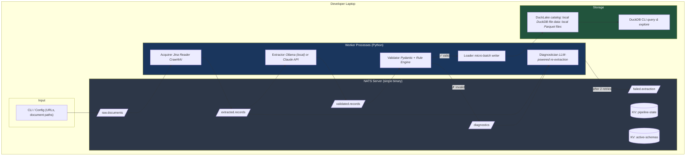

# Implementation Architecture
### MVP: Developer Laptop with DuckLake + NATS

---

## Design Principles

- **Runs entirely on a laptop.** No cloud accounts needed to start. Same code deploys to production later.
- **Effect-driven.** Every component communicates through typed effects (NATS messages). Components are independently testable.
- **Schema-driven extraction.** Pydantic models define what we extract. The models are the contract between extraction and storage.
- **Diagnostics-first validation.** Failures produce actionable information, not just error codes.

## System Overview



## Component Specifications

### 1. NATS Server

Single binary, zero configuration for local development.

```bash
# Install
curl -sf https://binaries.nats.dev/nats-io/nats-server/v2@latest | sh

# Run with JetStream enabled
nats-server --jetstream --store_dir ./data/nats
```

**Streams and subjects:**

```
Stream: DOCUMENTS
  raw.documents.>              # incoming URLs and file paths
  raw.documents.web.{source}   # per-source routing

Stream: EXTRACTION  
  extracted.records.>           # LLM extraction output
  extraction.request             # request-reply for LLM calls

Stream: VALIDATION
  validated.records.>            # passed validation
  diagnostics.>                  # structured failure info
  failed.extraction.>            # after max retries

KV Buckets:
  pipeline-state                 # dedup hashes, cursor positions
  active-schemas                 # current Pydantic models (serialized)
  extraction-metrics             # counters, latency, error rates
```

### 2. Acquirer

Fetches content from URLs or local files. Outputs clean markdown.

```python
# Pseudocode — actual implementation uses nats.py + crawl4ai
async def acquire(msg: RawDocumentMsg):
    url = msg.data.url

    # Dedup check
    doc_hash = hash(url + msg.data.fetch_date)
    if await kv_state.get(f"seen:{doc_hash}"):
        return  # already processed

    # Fetch and convert to markdown
    if is_pdf(url):
        markdown = await llm_whisperer.extract(url)
    else:
        markdown = await jina_reader.fetch(url)  # or crawl4ai

    # Publish
    await js.publish("extracted.records.raw", ExtractedDoc(
        source_url=url,
        content=markdown,
        doc_hash=doc_hash,
        acquired_at=utcnow()
    ))
    await kv_state.put(f"seen:{doc_hash}", "1")
```

### 3. Extractor

The core LLM extraction step. Uses request-reply for synchronous LLM calls.

```python
async def extract(msg: ExtractedDoc):
    # Load active schema for this document type
    schema = await get_schema(msg)  # from KV or default

    if schema:
        # Schema-driven extraction (fast path)
        result = await extract_with_schema(msg.content, schema)
    else:
        # Unsupervised extraction (discovery path)
        result = await extract_unsupervised(msg.content)

    await js.publish("validated.records.pending", ExtractionResult(
        source=msg,
        data=result.json,
        confidence=result.confidence,
        schema_version=schema.version if schema else None
    ))

async def extract_with_schema(content: str, schema: PydanticModel):
    """Request-reply to LLM with schema."""
    prompt = f"""Extract data from this document according to this schema:
{schema.model_json_schema()}

{format_few_shot_examples(schema)}  # from DuckLake

Document:
{content}

Return valid JSON matching the schema exactly."""

    # Try local model first (Ollama), fall back to cloud
    try:
        return await ollama.generate(prompt, format="json")
    except LowConfidenceError:
        return await claude.generate(prompt, format="json")
```

### 4. Validator

Pydantic validation + declarative rules. Produces diagnostics on failure.

```python
async def validate(msg: ExtractionResult):
    diagnostics = []

    # Layer 1: Pydantic schema validation
    try:
        record = msg.schema.model_validate(msg.data)
    except ValidationError as e:
        diagnostics.extend(
            Diagnostic(field=err["loc"], issue=err["msg"], type="validity")
            for err in e.errors()
        )

    # Layer 2: Rule engine
    if not diagnostics:  # only if structurally valid
        rule_results = rule_engine.evaluate(record, ruleset="procurement-se")
        diagnostics.extend(
            Diagnostic(field=r.field, issue=r.message, severity=r.severity)
            for r in rule_results if r.severity in ("error", "warning")
        )

    if any(d.type == "validity" for d in diagnostics):
        # Hard failure — needs re-extraction
        await js.publish("diagnostics", DiagnosticReport(
            source=msg,
            diagnostics=diagnostics,
            retry_count=msg.retry_count + 1
        ))
    else:
        # Valid (possibly with warnings)
        await js.publish("validated.records.ready", ValidatedRecord(
            data=record,
            warnings=[d for d in diagnostics if d.severity == "warning"],
            source_url=msg.source.source_url
        ))
```

### 5. Diagnostician

Feeds structured diagnostics back to the LLM for self-correction.

```python
async def diagnose_and_retry(msg: DiagnosticReport):
    if msg.retry_count > 2:
        await js.publish("failed.extraction", msg)
        return

    prompt = f"""Your previous extraction had these issues:
{format_diagnostics(msg.diagnostics)}

Original document:
{msg.source.content}

Please re-extract, specifically addressing each diagnostic."""

    result = await claude.generate(prompt, format="json")  # use best model for retries

    await js.publish("extracted.records.retry", ExtractionResult(
        source=msg.source,
        data=result,
        retry_count=msg.retry_count,
        diagnostics_addressed=msg.diagnostics
    ))
```

### 6. Loader

Micro-batch writer to DuckLake.

```python
async def load(batch: list[ValidatedRecord]):
    """Triggered every 10 records or 30 seconds, whichever comes first."""

    # Convert to Arrow/DataFrame
    df = records_to_dataframe(batch)

    # Write to DuckLake
    with duckdb.connect("ducklake:./data/procurement.ducklake") as conn:
        conn.execute("""
            INSERT INTO procurement.contracts
            SELECT * FROM df
        """)
        # DuckLake handles snapshot creation automatically
```

### 7. DuckLake Setup

```python
import duckdb

conn = duckdb.connect()

# Install and load DuckLake
conn.execute("INSTALL ducklake; LOAD ducklake;")

# Create the lakehouse (local file for MVP)
conn.execute("""
    ATTACH 'ducklake:./data/procurement.ducklake' AS lake;
""")

# Create schema and tables
conn.execute("""
    CREATE SCHEMA lake.procurement;

    CREATE TABLE lake.procurement.contracts (
        id              VARCHAR,
        source_url      VARCHAR,
        authority_name  VARCHAR,
        vendor_name     VARCHAR,
        contract_value  DECIMAL(18,2),
        currency        VARCHAR,
        effective_date  DATE,
        procurement_type VARCHAR,
        jurisdiction    VARCHAR,
        extracted_at    TIMESTAMP,
        confidence      FLOAT,
        schema_version  INTEGER
    );

    CREATE TABLE lake.procurement.diagnostics_log (
        source_url      VARCHAR,
        field           VARCHAR,
        issue           VARCHAR,
        severity        VARCHAR,
        resolved        BOOLEAN,
        occurred_at     TIMESTAMP
    );
""")
```

**Querying:**

```sql
-- Time travel: see data as of last week
SELECT * FROM lake.procurement.contracts
    AT (TIMESTAMP => TIMESTAMP '2025-02-08 00:00:00');

-- Extraction quality metrics
SELECT
    jurisdiction,
    COUNT(*) as total,
    AVG(confidence) as avg_confidence,
    COUNT(*) FILTER (confidence < 0.8) as low_confidence
FROM lake.procurement.contracts
GROUP BY jurisdiction;

-- Diagnostic patterns (candidates for new rules)
SELECT field, issue, COUNT(*) as occurrences
FROM lake.procurement.diagnostics_log
WHERE resolved = false
GROUP BY field, issue
ORDER BY occurrences DESC;
```

## Rule Engine

Declarative rules in YAML, evaluated as DuckDB queries or Python predicates.

```yaml
# rules/procurement-se.yaml
ruleset: procurement-se
description: Swedish procurement compliance (LOU)
version: 1

rules:
  - id: threshold-check
    type: validity
    description: Public tender required above EU threshold
    match:
      field: contract_value
      condition: "> 140000 AND currency = 'EUR'"
    requires:
      procurement_type: ["open_tender", "restricted_tender"]
    diagnostic: >
      Contract value {contract_value} {currency} exceeds EU services
      threshold. Procurement type '{procurement_type}' may not comply.

  - id: single-bid-warning
    type: quality
    description: Flag tenders with only one bidder
    match:
      field: bid_count
      condition: "= 1"
    severity: warning
    diagnostic: >
      Only one bid received for tender {tender_ref}.
      Consider whether requirements were unnecessarily restrictive.

  - id: fast-evaluation
    type: anomaly
    description: Unusually short evaluation period
    match:
      expression: "award_date - tender_close_date < INTERVAL '7 days'"
    severity: advisory
    diagnostic: >
      Evaluation completed in {days} days. This is unusually fast
      and may warrant review.
```

## Project Structure

```
procurement-mvp/
├── pyproject.toml
├── README.md
├── config/
│   ├── nats.conf                    # NATS server config
│   └── sources.yaml                 # URLs and schedules
├── schemas/
│   ├── base.py                      # Base Pydantic models
│   ├── contract.py                  # ContractRecord schema
│   └── tender.py                    # TenderNotice schema
├── rules/
│   ├── procurement-se.yaml          # Swedish rules
│   ├── procurement-eu.yaml          # EU directive rules
│   └── extraction-quality.yaml      # Data quality rules
├── workers/
│   ├── acquirer.py
│   ├── extractor.py
│   ├── validator.py
│   ├── diagnostician.py
│   └── loader.py
├── engine/
│   ├── rules.py                     # Rule evaluation engine
│   ├── effects.py                   # Effect types and routing
│   └── metrics.py                   # Quality tracking
├── data/                            # Local storage (gitignored)
│   ├── nats/                        # JetStream data
│   └── procurement.ducklake         # DuckLake catalog + parquet
└── scripts/
    ├── setup.sh                     # Install NATS, Ollama, create streams
    ├── seed.sh                      # Load sample documents
    └── query.sql                    # Useful DuckDB queries
```

## Getting Started (5 commands)

```bash
# 1. Install dependencies
pip install nats-py duckdb pydantic crawl4ai ollama

# 2. Start NATS
nats-server --jetstream --store_dir ./data/nats &

# 3. Pull a local LLM
ollama pull llama3.1:8b

# 4. Initialize DuckLake
python -c "import duckdb; duckdb.execute(\"INSTALL ducklake\")"

# 5. Run the pipeline
python -m workers.acquirer &
python -m workers.extractor &
python -m workers.validator &
python -m workers.loader &
```

## MVP Scope — What's In and Out

| In (build first) | Out (later phases) |
|---|---|
| Single-source scraping (one procurement portal) | Multi-source with discovery |
| Schema-driven extraction (predefined Pydantic models) | Schema emergence from data |
| Local Ollama + Claude API fallback | Student model training |
| Pydantic validation + YAML rules | Auto-generated rules from diagnostics |
| DuckLake on local disk | PostgreSQL + S3 for production |
| CLI-driven | Scheduled / event-driven |
| Manual diagnostics review | Automated diagnostics loop |

## Evolution Path

```mermaid
graph LR
    subgraph MVP["MVP (this doc)"]
        direction TB
        M1["Single source"]
        M2["Predefined schemas"]
        M3["Local DuckLake"]
        M4["Manual rules"]
    end

    subgraph V2["Phase 2"]
        direction TB
        P1["Multiple sources"]
        P2["Diagnostics loop"]
        P3["Student model training"]
        P4["Rule engine with packages"]
    end

    subgraph V3["Phase 3"]
        direction TB
        F1["Schema discovery"]
        F2["Effect-stream abstraction (docs → processes)"]
        F3["PostgreSQL + S3"]
        F4["Auto-generated rules"]
    end

    MVP ==> V2 ==> V3

    style MVP fill:#2d3748,color:#fff
    style V2 fill:#1a365d,color:#fff
    style V3 fill:#22543d,color:#fff
```



Each phase is independently useful. Nothing built in the MVP is thrown away — it becomes the foundation for subsequent phases.

---

*This document is part of a three-document set. See also: Executive Summary (opportunity overview) and Vision Document (conceptual framework).*
