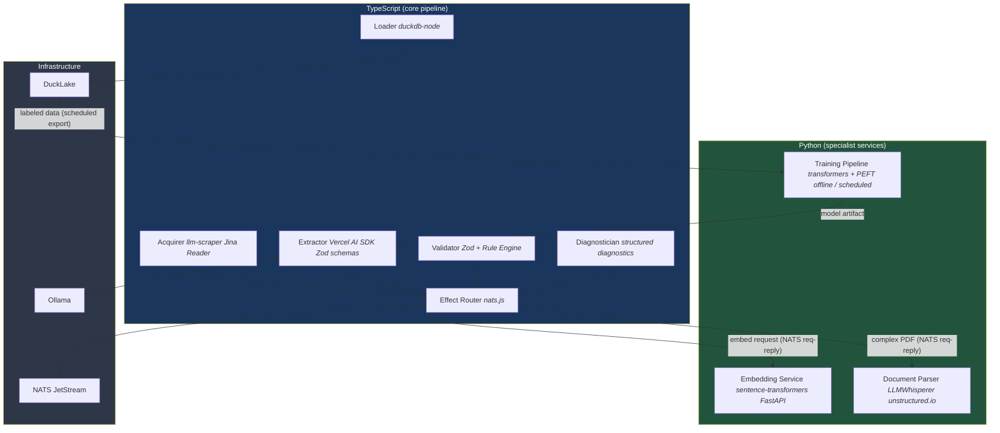

# Technology Stack Choices
### TypeScript-first, Python where it earns its place

---

## Guiding Principle

TypeScript is the default. Every component starts as TypeScript unless there's a concrete, demonstrable reason Python is the better choice. "The Python ecosystem is bigger" is not sufficient. "This specific capability only exists in Python and would take weeks to replicate" is.

The result is a system where the core pipeline, effect system, and domain logic are TypeScript (sharing types with vivief), with Python used as a specialist tool for ML training and advanced NLP tasks that genuinely require it.

---

## The Stack

### Core Pipeline — TypeScript

Everything that runs in the hot path.

| Component | Library | Role |
|-----------|---------|------|
| **Schema & validation** | Zod | Define extraction schemas, validate LLM output, generate JSON Schema for prompts. Types flow through the entire pipeline. |
| **LLM integration** | Vercel AI SDK | Unified interface to Ollama (local), Claude, GPT-4o. Built-in Zod schema support via `generateObject()`. Swap providers with one line. |
| **Web scraping** | llm-scraper + Playwright | Schema-driven extraction from web pages. The `generate` mode produces reusable Playwright scripts — our primary path to cheap deterministic extraction. |
| **URL → Markdown** | Jina Reader API | HTTP call, language-agnostic. Handles JS rendering, PDF reading, content cleaning. |
| **Messaging** | nats.js | First-class TypeScript client. Async iterators, JetStream, KV store. All effect routing. |
| **Storage queries** | duckdb-node | DuckLake access, analytical queries, time travel. Official binding, promise-based. |
| **Effect system** | Custom (shared with vivief) | `(State, Effect) → (State', Effect[])` — TypeScript interfaces and discriminated unions. The architectural backbone. |
| **Rule engine** | Custom | YAML rule definitions evaluated as TypeScript predicates. Zod validates rule inputs. |
| **Diagnostics** | Custom (shared with vivief) | Structured diagnostic types. Same pattern as vivief's code diagnostics. |
| **Configuration** | cosmiconfig + Zod | Type-safe config loading and validation. |

**Why TypeScript for all of these:** Type safety end-to-end. Zod infers types from schemas, so extractor output → validator input → loader input → DuckLake columns are all statically checked. Shared type definitions with vivief. Single runtime, single build system, single deployment model. And llm-scraper's `generate` mode — which produces JavaScript extraction scripts from LLM analysis — is TypeScript-only and is arguably the most elegant teacher-student path available.

### ML & NLP Specialist Tasks — Python

Things that genuinely don't have TypeScript equivalents of comparable quality.

| Component | Library | Role |
|-----------|---------|------|
| **Embedding generation** | sentence-transformers | Local embedding models (all-MiniLM-L6-v2) for cosine similarity filtering and schema clustering. The models, the tokenizers, and the ONNX runtime are all Python-native. |
| **Student model training** | transformers + PEFT | Fine-tuning BERT/XLM-RoBERTa on LLM-generated labels. LoRA adapters, training loops, evaluation. No credible TypeScript alternative exists. |
| **Advanced document parsing** | LLMWhisperer client, unstructured.io | Scanned PDFs, handwritten documents, complex table extraction. The heavy OCR + layout analysis tooling is Python. |
| **Schema clustering** | scikit-learn, UMAP | Clustering extracted field patterns to discover schema candidates. NumPy/SciPy ecosystem. |

**Why Python for these specifically:** The ML training ecosystem (PyTorch, Hugging Face transformers, PEFT) is Python-only in any practical sense. Sentence-transformers for local embeddings has no TypeScript equivalent that runs local models. And the advanced document parsing libraries (handling scanned PDFs with complex layouts) are overwhelmingly Python. These aren't preferences — they're hard constraints.

### Infrastructure — Language-agnostic

| Component | Tool | Notes |
|-----------|------|-------|
| **Message broker** | NATS Server | Single Go binary. No language dependency. |
| **Local LLM** | Ollama | HTTP API. Called from TypeScript via Vercel AI SDK. |
| **Lakehouse** | DuckLake + DuckDB | Accessed via duckdb-node from TypeScript, or duckdb CLI directly. |
| **Browser automation** | Playwright | TypeScript-native (Microsoft). Used by llm-scraper. |

---

## How They Connect



The boundary is clean: **TypeScript owns the pipeline and the effect system. Python services are called via NATS request-reply and return data.** The Python services are stateless workers — they receive a payload, do their specialist task, and return a result. They don't participate in the effect routing or pipeline orchestration.

---

## The Python Integration Pattern

Python services are thin wrappers with a NATS interface. They don't import any TypeScript code or share types directly — they communicate via JSON over NATS.

```python
# embedding_service.py — complete service
import nats
from sentence_transformers import SentenceTransformer

model = SentenceTransformer('all-MiniLM-L6-v2')

async def main():
    nc = await nats.connect("nats://localhost:4222")

    async def handle_embed(msg):
        request = json.loads(msg.data)
        embeddings = model.encode(request["texts"]).tolist()
        await msg.respond(json.dumps({"embeddings": embeddings}).encode())

    await nc.subscribe("embed.request", cb=handle_embed)
```

Called from TypeScript:

```typescript
// From any TypeScript worker
const response = await nc.request(
  'embed.request',
  codec.encode({ texts: ['procurement contract award Skanska'] }),
  { timeout: 5_000 }
);
const { embeddings } = codec.decode(response.data);
```

The Python service could be replaced by a TypeScript implementation later (e.g., if ONNX.js matures enough for local embeddings) without changing any pipeline code — just a faster response on the same NATS subject.

---

## The Training Pipeline (Python, offline)

Student model training is fundamentally an offline, batch process. It doesn't need to be in the hot path or share the pipeline's event system. It reads from DuckLake, trains a model, and produces an artifact.

```python
# train_student.py — runs on schedule or manually
import duckdb
from transformers import AutoModelForTokenClassification, Trainer
from peft import LoraConfig, get_peft_model

# Read LLM-labeled data from DuckLake
conn = duckdb.connect()
conn.execute("ATTACH 'ducklake:./data/procurement.ducklake' AS lake")
training_data = conn.execute("""
    SELECT content, extracted_json, confidence
    FROM lake.procurement.extraction_log
    WHERE confidence > 0.9 AND validated = true
""").fetchdf()

# Fine-tune with LoRA (parameter-efficient, runs on laptop GPU)
model = AutoModelForTokenClassification.from_pretrained("xlm-roberta-base")
model = get_peft_model(model, LoraConfig(r=16, lora_alpha=32))
trainer = Trainer(model=model, train_dataset=prepare(training_data))
trainer.train()

# Export for serving
model.save_pretrained("./models/student-procurement-v1")
```

The trained model can then be served either via a Python NATS service or (for simpler models) converted to ONNX and run from TypeScript.

---

## Decision Log

Documenting *why* each choice was made, so it can be revisited.

| Decision | Choice | Rationale | Revisit when... |
|----------|--------|-----------|-----------------|
| Pipeline language | TypeScript | Shared types with vivief, Zod end-to-end, llm-scraper generate mode | Never (architectural) |
| Schema validation | Zod | TypeScript-native, JSON Schema export, Vercel AI SDK integration | Never (too deeply integrated) |
| LLM SDK | Vercel AI SDK | Multi-provider, Zod-native, streaming, TypeScript-first | A better TS LLM SDK emerges |
| Web scraping | llm-scraper + Playwright | Type-safe, generate mode, TS-native | Crawl4AI gets a TS port |
| URL → Markdown | Jina Reader API | Zero setup, good quality, free tier | Self-hosting needed for data sensitivity |
| Messaging | NATS | Lightweight, req-reply, KV store, single binary | Never (architectural) |
| Lakehouse | DuckLake | Simplest path, DuckDB-native, laptop-friendly | Need multi-engine access (→ Iceberg) |
| Local embeddings | Python + sentence-transformers | No credible TS alternative for local models | ONNX.js + TS wrappers mature |
| Model training | Python + transformers | No alternative exists | Never (ML training is Python) |
| Complex PDF parsing | Python + LLMWhisperer | Best OCR/layout tools are Python | Jina Reader handles all our PDFs |
| Schema clustering | Python + scikit-learn | NumPy ecosystem, proven algorithms | Embedding + clustering moves to a managed service |

---

## MVP Simplification

For the initial MVP, the Python services aren't needed yet:

```
MVP (TypeScript only):
  ✅ Jina Reader for URL → Markdown (no local parsing needed)
  ✅ Vercel AI SDK + Ollama for extraction (no student model yet)
  ✅ Zod for validation (no embedding-based filtering yet)
  ✅ nats.js for effects
  ✅ duckdb-node + DuckLake for storage

Add Python when:
  📋 You need local embeddings for cosine similarity filtering
  📋 You have enough labeled data to train a student model
  📋 You encounter scanned/handwritten PDFs that Jina can't handle
  📋 You want schema clustering for the discovery phase
```

This means the MVP is **100% TypeScript** with zero Python dependencies. Python enters when the system matures enough to benefit from ML capabilities — and when it does, it enters as isolated NATS services that the TypeScript pipeline calls, not as a co-resident in the same codebase.
