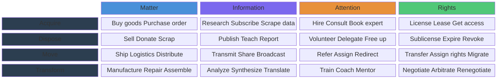
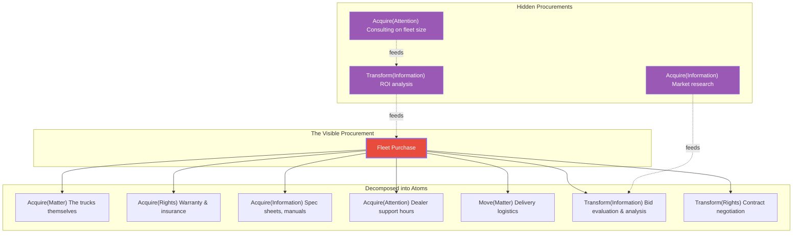
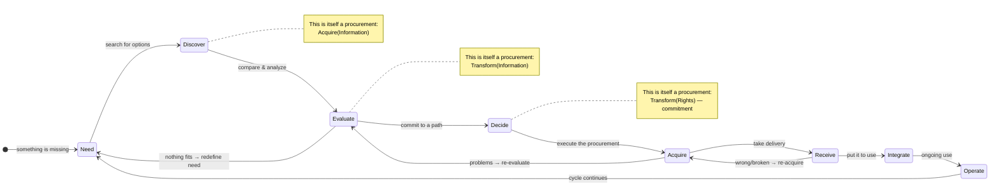
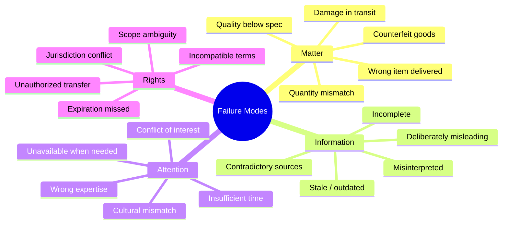
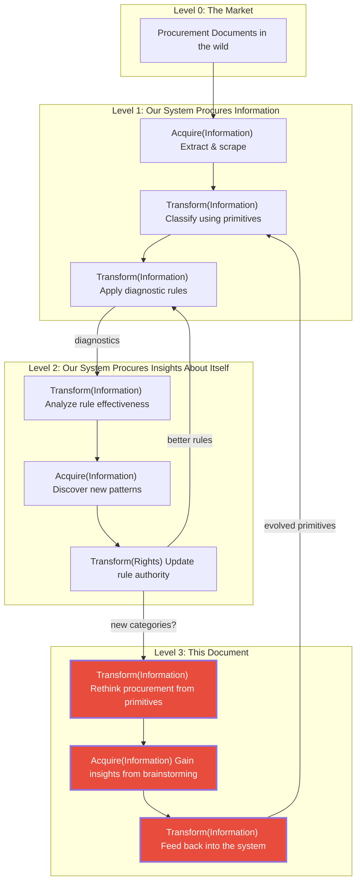
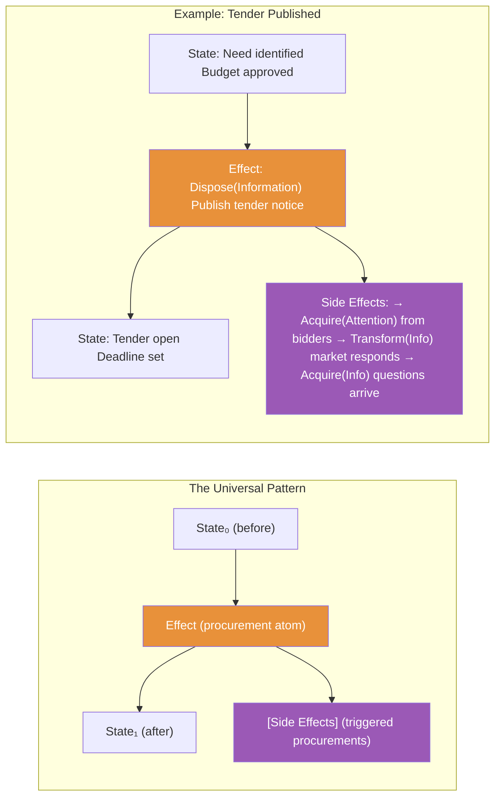
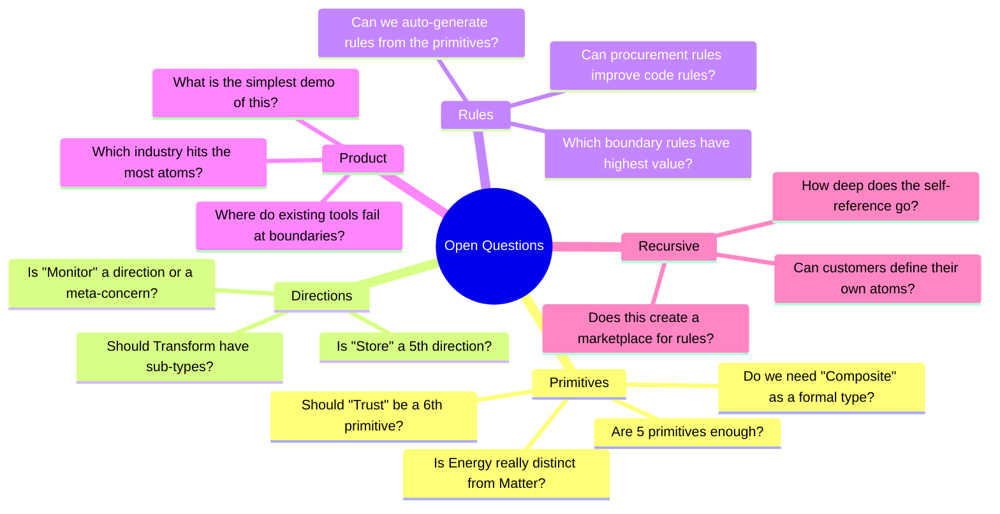

# Procurement from First Principles

**A Crazy-Useful Exploration of What Procurement Actually Is**

*For: Dev Team, Business, Sales & Procurement Experts — Brainstorming Document*
*Status: Living document — meant to trigger insights, not conclude them*

---

## The Question

What if we forgot everything we know about procurement software and asked:
**What are people actually doing when they procure?**

Not "what ERP modules exist" but "what are the elementary particles of getting things done through others?"

If we can name these particles, we can detect them in documents, compose them into processes, write rules for them, and — here's the recursive bit — use procurement *of insights* to improve our understanding of procurement itself.

---

## Part 1: The Atomic Primitives

### What Moves Between Parties?

Strip away the contracts, the ERPs, the jargon. Only five kinds of things ever actually transfer:

| Primitive | What it is | Examples |
|-----------|-----------|----------|
| **Matter** | Physical stuff | Goods, equipment, raw materials, food |
| **Energy** | Capacity to do work | Electricity, compute, bandwidth, fuel |
| **Information** | Knowledge, data, signals | Reports, data feeds, research, advice |
| **Attention** | Someone's time & focus | Consulting hours, labor, support |
| **Rights** | Permission to do/use/access | Licenses, leases, patents, access |

### What Directions Can It Go?

Only four things you can do with any of those:

| Direction | Meaning | The effect pattern |
|-----------|---------|-------------------|
| **Acquire** | You get it | `(Need) → (Have, [Obligations])` |
| **Dispose** | You give it away | `(Have) → (Gone, [Receipts])` |
| **Move** | It goes from A to B | `(Here) → (There, [Tracking])` |
| **Transform** | It changes form | `(Raw) → (Refined, [Waste])` |

### The Periodic Table of Procurement

Every procurement in the world is a cell in this matrix, or a *composition* of cells:



**Key insight for the product:** Every document we extract can be tagged with one or more `(What, Direction)` pairs. This gives us a *type system* for procurement — not from regulation categories, but from what's actually happening.

---

## Part 2: Compound Procurements

Real procurements are almost never atomic. They're compositions.

### Example: Buying a Fleet of Trucks



**Key insight for sales:** The "hidden procurements" (the dashed lines) are where most value is lost and where our system finds things competitors miss. Traditional procurement software only sees the visible box.

### The Composition Pattern

Any real procurement `P` can be expressed as:

```
P = atom₁ · atom₂ · atom₃ · ... · atomₙ
```

Where `·` means "composed with" and each atom is a `(What, Direction)` pair. The order matters — some atoms depend on outputs of others. This gives us a **procurement graph** where:

- **Nodes** are atomic procurements
- **Edges** are dependencies (output of one feeds input of another)
- **Clusters** are what humans call "a procurement"

---

## Part 3: The Customer Journey as Effect Chains

From the customer's perspective, every procurement is a sequence of state transitions. Here's the universal pattern:



### Each Phase Is Itself a Procurement

This is the recursive insight. Mapping each customer journey phase to our primitives:

| Journey Phase | Is actually... | Atomic type |
|---------------|---------------|-------------|
| **Need** | Recognizing a gap | `Transform(Information)` — internal analysis |
| **Discover** | Finding what's out there | `Acquire(Information)` |
| **Evaluate** | Making sense of options | `Transform(Information)` + `Acquire(Attention)` from experts |
| **Decide** | Committing resources | `Transform(Rights)` — authorization |
| **Acquire** | The actual transaction | `Acquire(Matter\|Energy\|Information\|Attention\|Rights)` |
| **Receive** | Taking delivery | `Move(*)` — transfer of whatever was acquired |
| **Integrate** | Putting it to work | `Transform(*)` — making it part of your operation |
| **Operate** | Using it | The steady state that eventually produces a new `Need` |

**Key insight for the product:** If we can detect which *phase* a document belongs to, we know what the customer is actually doing, not just what category the document falls in. A "requirements specification" is a `Transform(Information)` in the *Need→Discover* transition. A "bid evaluation matrix" is a `Transform(Information)` in the *Evaluate→Decide* transition. Same atomic type, completely different business meaning — distinguished by where they sit in the journey.

---

## Part 4: Failure Modes — Where Things Break

Each primitive type has characteristic failure modes. These map directly to **diagnostic rules**:



### Failure Patterns That Cross Categories

The most expensive failures happen at the *boundaries* between atomic types:

| Boundary Failure | What happens | Example |
|-----------------|-------------|---------|
| **Matter↔Information** | What was described ≠ what arrived | Spec says steel grade A, shipment is grade B |
| **Information↔Attention** | Expert advice based on wrong data | Consultant optimizes based on last year's numbers |
| **Attention↔Rights** | Work done outside scope | Contractor delivers extra features, invoices for them |
| **Rights↔Matter** | License doesn't cover actual use | Software licensed for 50 seats, deployed to 200 |
| **Matter↔Energy** | Physical asset can't be powered | Data center equipment exceeds available power |

**Key insight for rules:** The highest-value rules detect boundary failures. These are the rules that save organizations the most money and are hardest to write without our primitive decomposition.

### The Diagnostic Pattern

Every failure follows the same shape:

```
Expected: (What, Direction, Spec)
Observed: (What, Direction, Actual)
Diagnostic: Spec ≠ Actual → [correction effects]
```

This is **identical** to how vivief detects code anomalies:

```
Expected: function should return Promise<User>
Observed: function returns User | undefined  
Diagnostic: type mismatch → [suggested fix effects]
```

---

## Part 5: The Self-Referential Loop

Here's where it gets properly crazy. Our system that analyzes procurement IS a procurement system:



### What This Means Practically

**For the MVP:** The system should track its own operations using the same primitives it uses to analyze procurement documents. When we extract a tender notice, that extraction is itself an `Acquire(Information)` event. When we run rules against it, that's a `Transform(Information)` event. When a rule fires a diagnostic, that's a `Dispose(Information)` — publishing a finding.

**For sales:** We can tell customers: *"Our system doesn't just analyze your procurement — it IS a procurement system, and it improves itself the same way it improves your processes."*

**For the team:** The self-referential loop means every feature we build for customers automatically becomes a feature we can use internally. Rule effectiveness monitoring for customers = rule effectiveness monitoring for our own extraction rules.

---

## Part 6: The vivief Effect Mapping

Everything above maps to the vivief `(State, Effect) → (State', [Effect'])` pattern:



### The Four Rule Types (from vivief) Applied to Procurement

| Rule Type | In Code | In Procurement | Detection |
|-----------|---------|---------------|-----------|
| **Structural** | "This function has too many parameters" | "This tender has no evaluation criteria" | Missing atoms in expected composition |
| **Behavioral** | "This call never returns" | "This supplier always delivers late" | Patterns in effect sequences over time |
| **Relational** | "Module A depends on Module B cyclically" | "Evaluator is also a bidder" | Conflict in the procurement graph |
| **Temporal** | "Lock acquired but never released" | "Tender opened but never closed" | Incomplete state transitions |

---

## Part 7: What Falls Out of This

### New Product Capabilities

1. **Atomic Tagging** — every extracted document gets tagged with `(What, Direction)` pairs. This is cheap to compute and immediately useful for search, filtering, and anomaly detection.

2. **Composition Detection** — the system recognizes that a set of documents forms a compound procurement and infers the graph structure. "These 47 documents are actually 3 procurements, one of which is a sub-procurement of another."

3. **Journey Phase Detection** — knowing the atoms lets us infer where in the customer journey each document sits, which predicts what should come next.

4. **Cross-Boundary Diagnostics** — the highest-value rules: detecting when Matter↔Information, Information↔Attention, or Rights↔Matter boundaries are violated.

5. **Self-Improvement Loop** — the system monitors its own extraction and classification as procurement events, using the same rules engine.

### New Market Angles

- **"Procurement X-Ray"** — decompose any procurement into its atoms, visualize the graph, spot what's missing
- **"Process Genome"** — every organization has procurement DNA (characteristic patterns of atom composition). Compare yours to benchmarks.
- **"Risk Radar"** — boundary failure detection as a service. The failures that cost the most are the ones between categories.
- **"Procurement Compiler"** — like a code compiler: take a high-level intent ("buy a fleet of trucks"), generate the expected atom sequence, and flag deviations as "compilation errors"

### Open Questions for Brainstorming



---

## Appendix: Reading This Document as a Procurement

This document is itself a compound procurement:

- **Acquire(Information)** — gathering concepts from code analysis, procurement domain, vivief framework
- **Transform(Information)** — synthesizing a new model from those inputs  
- **Dispose(Information)** — publishing this document for team discussion
- **Acquire(Attention)** — requesting the team's time and focus to brainstorm
- **Transform(Information)** — the brainstorming session will produce new insights
- **→ [Side Effects]** — new rules, product ideas, market angles, and probably more questions

The side effects of reading this document are the real product.

---

*Next iteration: pick any branch from the Open Questions mindmap and we spiral deeper.*
