# Foundation Visual Vision Architecture

> Visual architecture companion to [foundation.md](./foundation.md)
> This document shows system structure through diagrams - the "what" in visual form.

---

## 1. System Overview

The DevAC system extracts queryable state from sources of truth and makes it available to humans, LLMs, and automated systems.

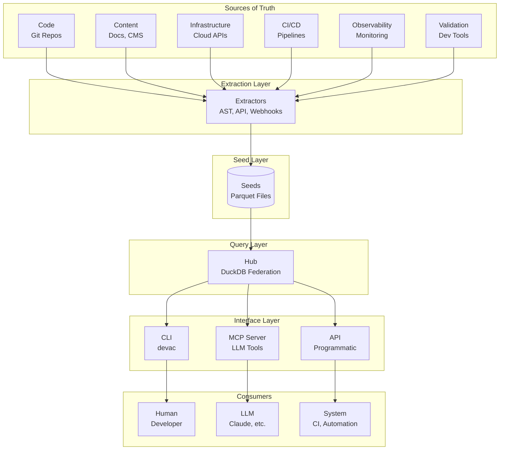

**Key Principle**: Sources of truth are sacred. Seeds are derived, queryable representations - never authoritative.

---

## 2. Workspace Model

Development spans multiple repositories. DevAC uses convention-based discovery to understand workspace structure.

### 2.1 Workspace Topology

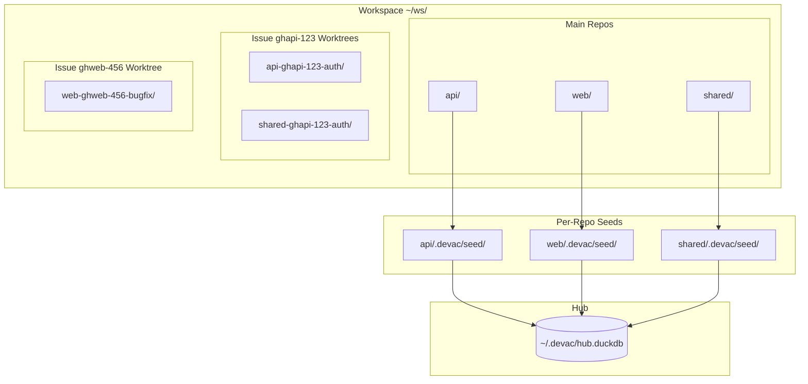

### 2.2 Context Discovery

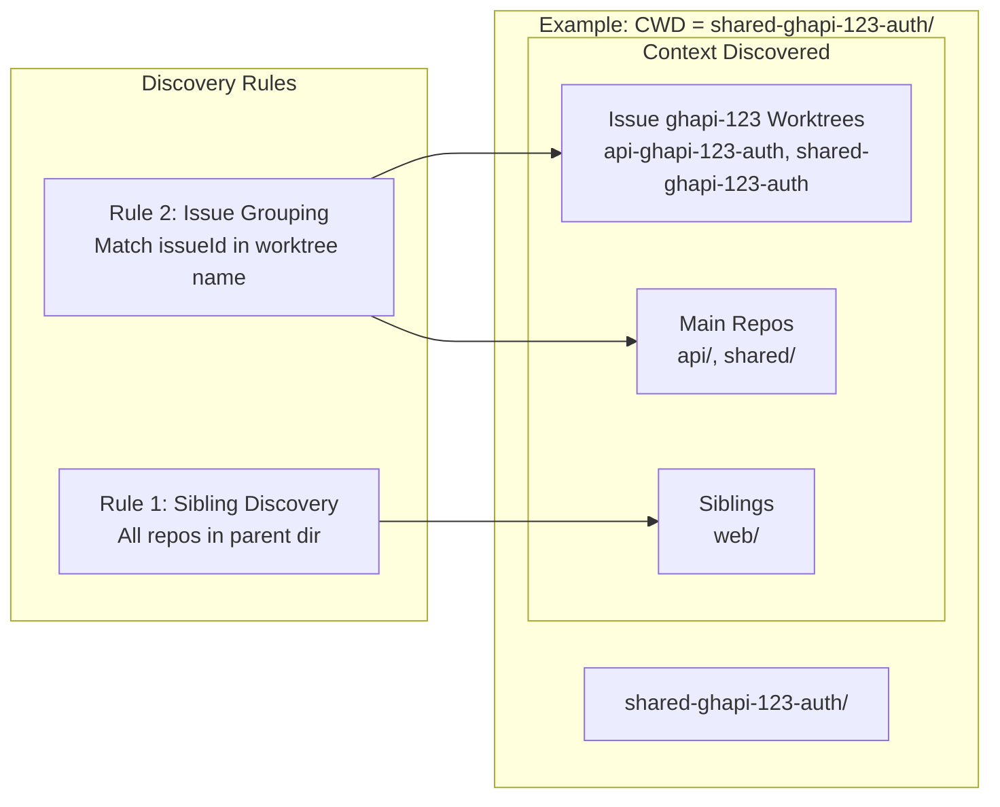

**issueId Parsing**: Split worktree name on first `-` for worktreeRepo, then extract issueId by finding the pattern `{source}{repo}-{number}` (split on last `-` for number).

### 2.3 Worktree Naming Convention

```
{worktreeRepo}-{issueId}-{slug}
       │           │        │
       │           │        └── Human-readable description
       │           └── Issue identifier: {source}{originRepo}-{number}
       └── Repo this worktree belongs to (may differ from issue origin)

Examples:
  api-ghapi-123-auth           → Worktree of api, for GitHub issue 123 from api
  shared-ghapi-123-auth        → Worktree of shared, for same issue (from api)
  web-ghweb-456-bugfix         → Worktree of web, for GitHub issue 456 from web
  api-PROJ-789-feature         → Worktree of api, for Jira issue PROJ-789

Parsing issueId (split on last dash for number):
  ghapi-123                    → source=gh, originRepo=api, number=123
  ghmonorepo-3.0-456           → source=gh, originRepo=monorepo-3.0, number=456
  PROJ-789                     → Jira key PROJ-789
```

---

## 3. Seed Architecture

Seeds are queryable representations of sources of truth, stored as Parquet files.

### 3.1 Seed Categories

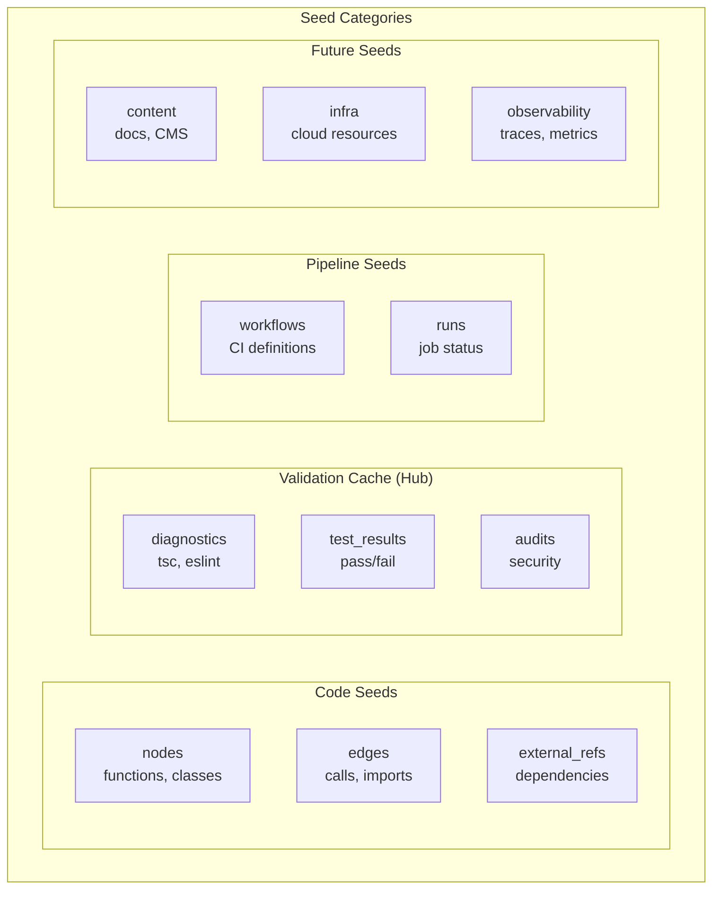

### 3.2 Seed Storage Model

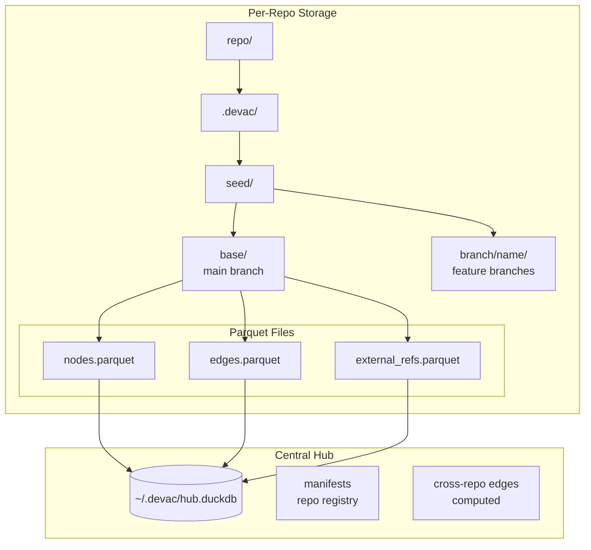

### 3.3 Validation Cache (Hub-Based)

Unlike code seeds which are stored as Parquet files per-repo, validation errors are stored directly in the Hub's DuckDB. This is because validation data is ephemeral (obsolete when fixed) and benefits from fast SQL writes over Parquet rewrites.

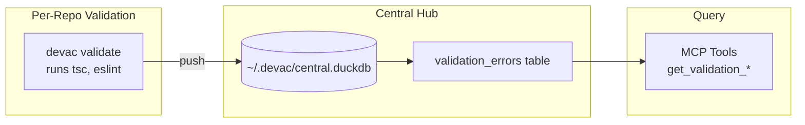

See [ADR-0017: Validation Hub Cache](./adr/0017-validation-hub-cache.md) for the decision rationale.

### 3.4 Federation Model

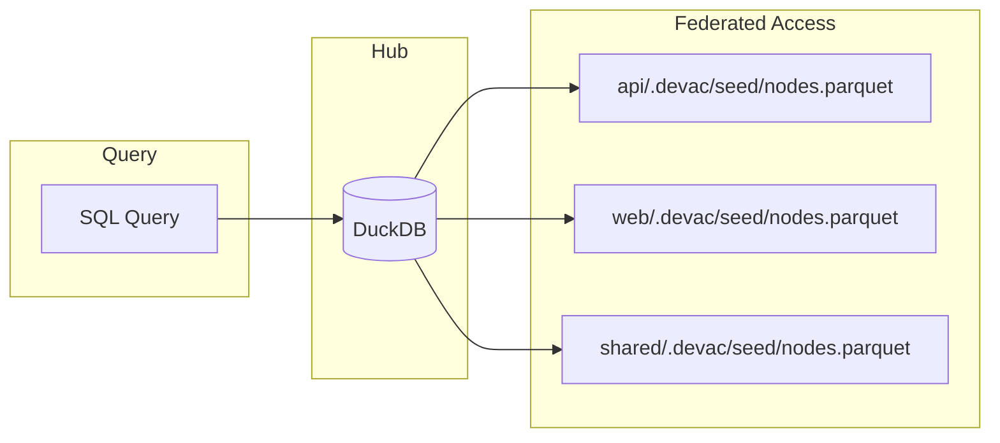

**Key**: Hub doesn't copy data - it queries Parquet files in place via DuckDB's federated query capability.

---

## 4. Effect Flow

Effects are the universal abstraction for all changes. See [foundation.md Section 5](./foundation.md#5-effects-the-universal-abstraction) for definitions.

### 4.1 Code Effects Flow

Code Effects describe what code does - extracted from AST analysis.

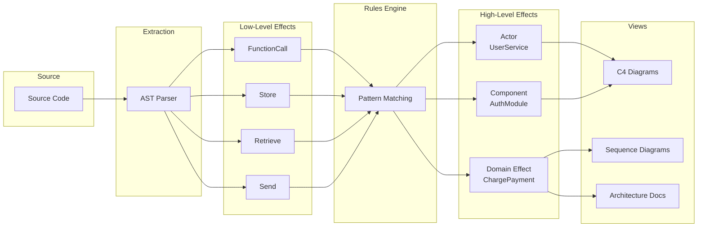

### 4.2 Workflow Effects Flow

Workflow Effects describe development activity - triggering pipelines and updates.

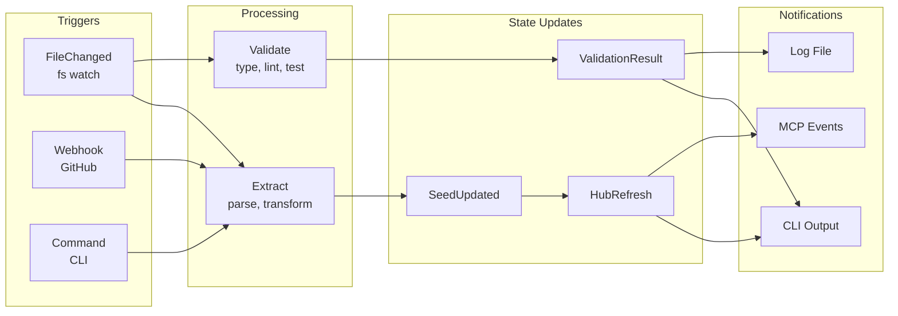

### 4.3 Effect Handler Chain

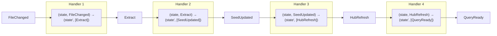

**Universal Pattern**: `effectHandler = (state, effect) => (state', [effect'])`

---

## 5. Data Flow Pipeline

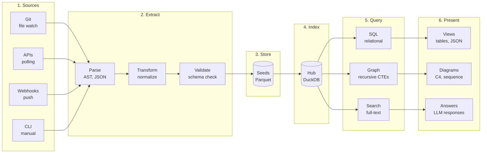

### 5.1 Update Mechanisms

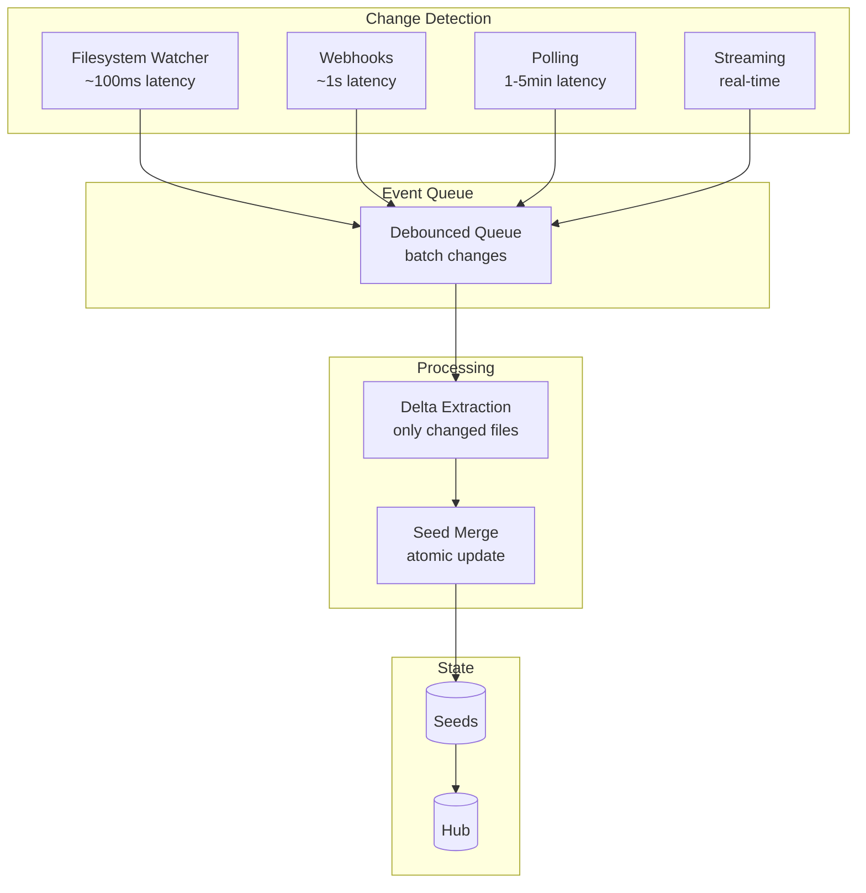

| Source Type | Mechanism | Latency | Example |
|-------------|-----------|---------|---------|
| Local files | Filesystem watch | ~100ms | Code changes |
| GitHub | Webhooks | ~1s | PR events, CI status |
| Cloud APIs | Polling | ~1-5min | AWS resources |
| Monitoring | Streaming | Real-time | OTEL traces |

---

## 6. Component Boundaries

### 6.1 Package Structure

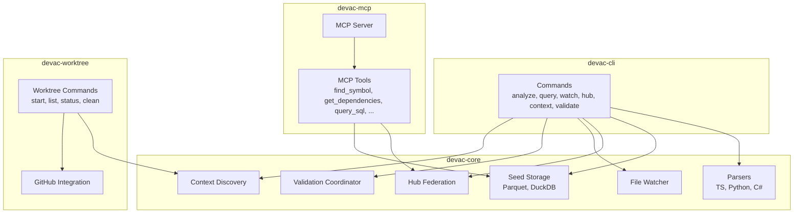

### 6.2 Dependency Flow

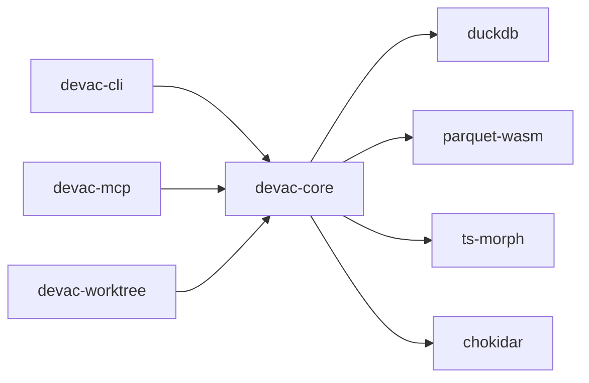

### 6.4 Workspace Module

The workspace module (`devac-core/src/workspace/`) orchestrates multi-repo operations.

```
┌─────────────────────────────────────────────────────────────────────┐
│                      WorkspaceManager                                │
│                  (orchestrates all workspace operations)             │
├─────────────────────────────────────────────────────────────────────┤
│                                                                     │
│  ┌──────────────┐   ┌──────────────┐   ┌──────────────────┐        │
│  │  Discovery   │   │   Watcher    │   │  Auto-Refresh    │        │
│  │              │   │              │   │                  │        │
│  │  - Scan dirs │   │  - Chokidar  │   │  - Debounce      │        │
│  │  - Parse IDs │   │  - Seed globs│   │  - Hub refresh   │        │
│  │  - Group WTs │   │  - Events    │   │  - Batch changes │        │
│  └──────────────┘   └──────────────┘   └──────────────────┘        │
│         │                  │                    │                   │
│         ▼                  ▼                    ▼                   │
│  ┌──────────────┐   ┌──────────────┐   ┌──────────────────┐        │
│  │    State     │   │ SeedDetector │   │   CentralHub     │        │
│  │ .devac/state │   │  *.parquet   │   │   (existing)     │        │
│  └──────────────┘   └──────────────┘   └──────────────────┘        │
│                                                                     │
└─────────────────────────────────────────────────────────────────────┘
```

**Effect Flow:**
```
SeedFileChanged → SeedDetector → AutoRefresher → Hub.refresh()
```

**Two-Tier Watching:**
```
┌─────────────────────────────────────────────────────────────────────┐
│  Per-Repo (devac watch)              Workspace (workspace watch)    │
│                                                                     │
│  Source Files ──► Seeds              Seeds ──► Hub                  │
│  *.ts, *.py, *.cs                    *.parquet                      │
│                                                                     │
│  Updates on source change            Refreshes on seed change       │
│  Run inside each repo                Run from parent directory      │
└─────────────────────────────────────────────────────────────────────┘
```

---

## 7. Human / LLM / System Boundaries

### 7.1 Responsibility Flow

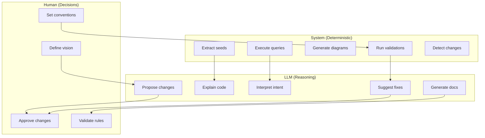

### 7.2 Collaboration Patterns

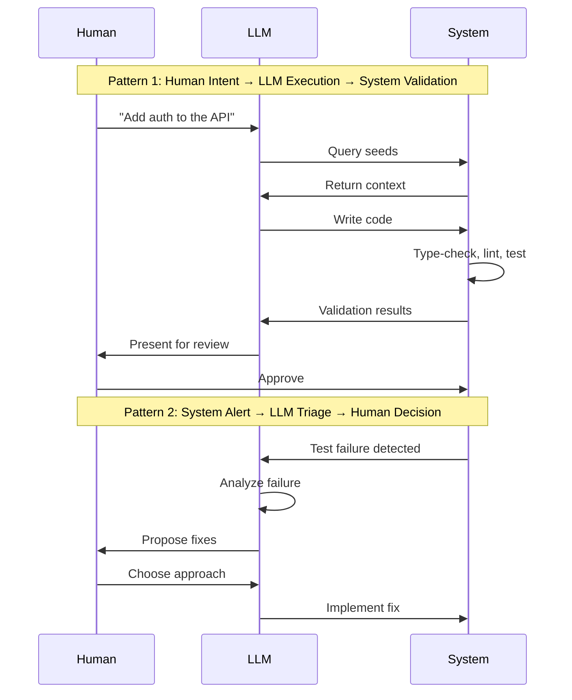

---

## 8. Query Architecture

### 8.1 Query Capabilities by Seed Type

| Seed Category | Graph | Relational | K-V | Full-Text | Vector |
|---------------|:-----:|:----------:|:---:|:---------:|:------:|
| Code          | ✓     | ✓          | ✓   | ✓         | ◐      |
| Validation    | -     | ✓          | ✓   | ✓         | -      |
| Pipeline      | ◐     | ✓          | ✓   | ✓         | -      |
| Content       | ◐     | ✓          | ✓   | ✓         | ✓      |
| Infra         | ✓     | ✓          | ✓   | ✓         | -      |
| Observability | ◐     | ✓          | ✓   | ✓         | -      |

*✓ = Primary, ◐ = Secondary, - = Not applicable*

### 8.2 Query Implementation

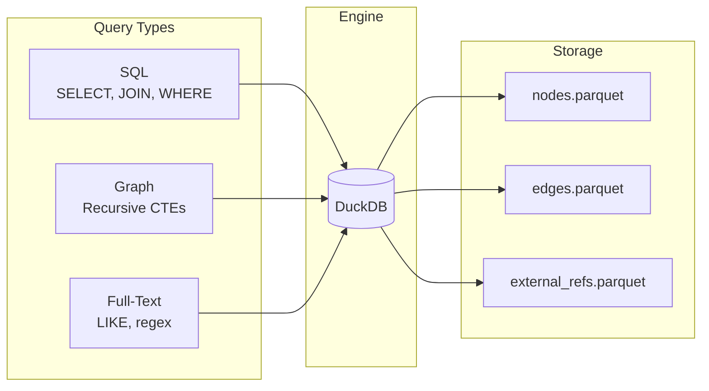

**Implementation**: SQL-first with graph traversal via recursive CTEs. No dedicated graph language needed.

### 8.3 MCP Tool Mapping

| MCP Tool | Query Type | Purpose |
|----------|------------|---------|
| `find_symbol` | Full-text | Search symbols by name |
| `get_dependencies` | Graph | Outgoing edges from symbol |
| `get_dependents` | Graph | Incoming edges to symbol |
| `get_file_symbols` | Relational | All symbols in a file |
| `get_affected` | Graph | Impact analysis |
| `get_call_graph` | Graph | Function call tree |
| `query_sql` | SQL | Arbitrary queries |
| `list_repos` | Relational | Hub registry |
| `get_context` | Relational | Sibling repos, worktrees, issues |
| `get_validation_errors` | Relational | Query cached validation errors |
| `get_validation_summary` | Relational | Grouped error counts |
| `get_validation_counts` | Relational | Total error/warning counts |

---

## 9. Document References

| Topic | Document | Section |
|-------|----------|---------|
| Core concepts | [foundation.md](./foundation.md) | All |
| Effects taxonomy | [foundation.md](./foundation.md) | Section 5 |
| Rules | [foundation.md](./foundation.md) | Section 5.6 |
| Effect Store | [foundation.md](./foundation.md) | Section 6 |
| Human/LLM/System | [foundation.md](./foundation.md) | Section 9 |
| Implementation status | [foundation-how.md](./foundation-how.md) | Section 2 |
| Bootstrap phases | [foundation-how.md](./foundation-how.md) | Section 1 |
| Rules implementation | [foundation-how.md](./foundation-how.md) | Section 4 |

---

*Version: 1.1 - Added validation hub cache, updated MCP tools*
*Visual companion to [foundation.md](./foundation.md)*
