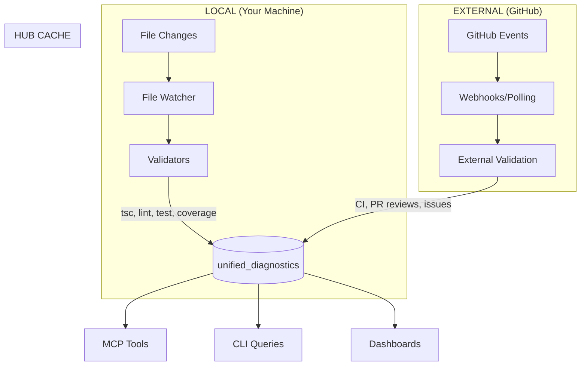

# Validation & Diagnostics

> A unified model where all diagnostics—local validation, CI results, GitHub issues, PR reviews—flow through the same watch-driven pattern into a queryable cache.

---

## 1. The Problem We're Solving

Development produces many signals about "what needs attention":

1. **Local validation** — TypeScript errors, lint violations, test failures, low coverage
2. **CI/CD results** — Build failures, deployment errors, action outcomes
3. **GitHub issues** — Bug reports, feature requests, tasks
4. **PR reviews** — Code review comments, change requests

These signals are:
- **Scattered** — Different tools, different formats, different APIs
- **Redundant** — LLMs re-run validation to get current state
- **Inconsistent** — No unified way to ask "what needs attention?"

**Our thesis**: All diagnostics follow the same pattern. By treating them identically and caching results in a unified table, we enable LLMs and humans to efficiently query "what needs attention" without re-running anything.

---

## 2. The Unified Model

### 2.1 The Pattern

All diagnostic sources follow the same three-stage flow:

```
WATCH           →    VALIDATE           →    CACHE
(trigger)            (deterministic)         (hub)
```

| Stage | What Happens | Who Runs It |
|-------|--------------|-------------|
| **Watch** | Detect changes (files or events) | System |
| **Validate** | Run checks, produce diagnostics | System |
| **Cache** | Store in hub for fast queries | System (implicit) |

### 2.2 Local vs External Sources

The pattern is identical—only WHERE it runs differs:



### 2.3 Diagnostic Sources

| Source | Trigger | Validator | Example Diagnostic |
|--------|---------|-----------|-------------------|
| `tsc` | File change | TypeScript compiler | "Property 'x' does not exist" |
| `eslint` | File change | ESLint/Biome | "Unexpected any" |
| `test` | File change | Vitest/Jest | "Expected true, got false" |
| `coverage` | File change | Coverage reporter | "Coverage: 45% (threshold: 80%)" |
| `ci` | Push/PR | GitHub Actions | "Build failed" |
| `issue` | Issue created | Issue parser | "Bug: login not working" |
| `pr-review` | Review submitted | Review parser | "Please add tests" |

---

## 3. Core Principles

### 3.1 Hub is THE Cache

The hub is a **queryable cache**, not a source of truth.

| Aspect | Hub Cache | Source of Truth |
|--------|-----------|-----------------|
| **TypeScript errors** | `unified_diagnostics` table | `tsc` output |
| **Lint violations** | `unified_diagnostics` table | ESLint/Biome output |
| **CI status** | `unified_diagnostics` table | GitHub API |
| **Issues** | `unified_diagnostics` table | GitHub Issues |

**Implication**: Validation always updates the hub. There is no `--push-to-hub` flag—caching is implicit.

### 3.2 Watch is Primary

The primary flow is **automatic**:

```
Human/LLM edits file → Watch detects → Validate runs → Hub updates → Query returns new state
```

Manual commands (`devac validate`, `devac typecheck`) are fallbacks when watch isn't running.

### 3.3 Deterministic Validation

Same input = same output. This means:
- LLMs don't need to run validation—they query cached results
- Validation is a system responsibility, not LLM responsibility
- Reduces token usage and latency

### 3.4 Division of Labor

| Actor | Responsibility | Examples |
|-------|---------------|----------|
| **System** | Watch, validate, cache (deterministic) | Run tsc, update hub |
| **LLM** | Query diagnostics, propose fixes (reasoning) | "Fix this type error" |
| **Human** | Edit files, approve changes (agency) | Accept/reject proposal |

---

## 4. Data Model

### 4.1 Unified Diagnostics Schema

All sources produce the same shape:

```sql
unified_diagnostics (
  diagnostic_id   VARCHAR PRIMARY KEY,
  repo_id         VARCHAR,          -- "github.com/org/repo"
  source          VARCHAR,          -- tsc | eslint | test | coverage | ci | issue | pr
  file_path       VARCHAR,          -- affected file (null for non-file diagnostics)
  line_number     INTEGER,          -- line in file (null if not applicable)
  column_number   INTEGER,          -- column in file
  severity        VARCHAR,          -- error | warning | info
  category        VARCHAR,          -- validation | workflow
  title           VARCHAR,          -- short description
  description     VARCHAR,          -- full message
  code            VARCHAR,          -- error code (TS2345, no-unused-vars)
  resolved        BOOLEAN,          -- true when fixed
  created_at      TIMESTAMP,
  updated_at      TIMESTAMP
)
```

### 4.2 Ephemeral by Design

Diagnostics are **transient**:
- Issues appear when detected
- Issues disappear when fixed
- No long-term history (that's what Git is for)

---

## 5. Query Interface

### 5.1 CLI Commands

```bash
# Query all errors
devac diagnostics

# Filter by source
devac diagnostics --source tsc

# Filter by repo
devac diagnostics --repo-id github.com/org/repo

# Filter by category
devac diagnostics --category validation

# Get summary counts
devac hub summary counts
```

### 5.2 MCP Tools

LLMs access the same data via MCP:

| Tool | Purpose |
|------|---------|
| `get_diagnostics` | Query all diagnostics (validation + workflow) |
| `get_validation_diagnostics` | Query validation diagnostics only (tsc, lint, test, coverage) |
| `get_diagnostics_summary` | Get counts by source, severity, repo |

---

## 6. Current State & Gaps

### 6.1 What's Implemented

| Component | Status | Notes |
|-----------|--------|-------|
| TypeScript validation | Working | Via `validate` command |
| Lint validation (ESLint/Biome) | Working | Via `validate` command |
| Test validation | Partial | Aggregate stats only |
| Coverage validation | Working | Via `validate` command |
| Hub cache | Working | DuckDB unified_diagnostics table |
| MCP tools | Working | get_diagnostics_*, get_validation_* |
| Watch (local) | Partial | Per-repo, not workspace-wide |
| Watch (external) | Partial | Sync commands, not automatic |

### 6.2 Gaps to Address

| Gap | Impact | Recommendation |
|-----|--------|----------------|
| `--push-to-hub` is explicit | Violates "cache is implicit" | Remove flag, always push |
| Individual commands don't push | `typecheck`, `lint` don't update hub | Add implicit hub update |
| Test failures not granular | Can't query individual test failures | Enhance TestValidator |
| Coverage threshold missing | `validate` can't detect low coverage | Add `--coverage-threshold` |
| Watch not workspace-wide | Manual start per repo | Future: robust multi-repo watch |

---

## 7. Related Documents

| Document | Relationship |
|----------|--------------|
| [Concepts](./concepts.md) | Four Pillars, terminology, glossary |
| [Foundation](./foundation.md) | Effect Handler pattern, Human/LLM/System division |
| [Actors](./actors.md) | State machines as effects, runtime telemetry, validation quality loop |
| [ADR-0017: Validation Hub Cache](../adr/0017-validation-hub-cache.md) | Why DuckDB for validation cache |
| [ADR-0018: Unified Diagnostics Model](../adr/0018-unified-diagnostics-model.md) | Schema design for unified diagnostics |
| [ADR-0019: Coverage Validator](../adr/0019-coverage-validator.md) | Coverage as first-class diagnostic |

---

## 8. Summary

**The vision**: All diagnostics—local validation, CI results, issues, PR reviews—flow through the same pattern:

```
Watch → Validate → Cache → Query
```

**The benefit**: LLMs and humans can efficiently ask "what needs attention?" without re-running validation or querying multiple APIs.

**The principle**: Hub caching is implicit, not optional. Validation always updates the cache.
