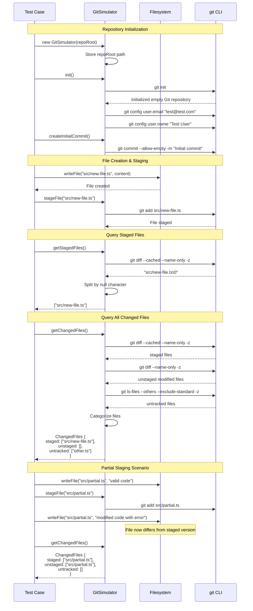

# Git Staging Flow Diagram

This sequence diagram shows how Git operations work within the test infrastructure.

## Git State Management in Tests



## Git Operations Reference

### Repository Setup

| Operation | Method | Git Command |
|-----------|--------|-------------|
| Initialize repo | `init()` | `git init` |
| Configure user | (automatic) | `git config user.email/name` |
| Initial commit | `createInitialCommit()` | `git commit --allow-empty -m "..."` |
| Check if repo | `isGitRepo()` | `git rev-parse --git-dir` |

### File Staging

| Operation | Method | Git Command |
|-----------|--------|-------------|
| Stage file | `stageFile(path)` | `git add <path>` |
| Stage all | `stageAll()` | `git add -A` |
| Unstage file | `unstageFile(path)` | `git reset HEAD <path>` |

### State Queries

| Operation | Method | Git Command |
|-----------|--------|-------------|
| Staged files | `getStagedFiles()` | `git diff --cached --name-only -z` |
| Unstaged files | `getUnstagedFiles()` | `git diff --name-only -z` |
| Untracked files | `getUntrackedFiles()` | `git ls-files --others --exclude-standard -z` |
| All changes | `getChangedFiles()` | All three above |

## File State Categories

```
┌─────────────────────────────────────────────────────────────┐
│                    Working Directory                         │
├───────────────┬───────────────┬───────────────┬─────────────┤
│   Committed   │   Staged      │   Modified    │  Untracked  │
│   (clean)     │   (indexed)   │   (unstaged)  │   (new)     │
├───────────────┼───────────────┼───────────────┼─────────────┤
│ Already in    │ git add'd     │ Changed but   │ New files   │
│ last commit   │ ready to      │ not staged    │ not in Git  │
│               │ commit        │               │             │
└───────────────┴───────────────┴───────────────┴─────────────┘

      ◄── getStagedFiles() ──►
                          ◄── getUnstagedFiles() ──►
                                              ◄── getUntrackedFiles() ──►
```

## Test Scenarios

### Clean Package (No Changes)

```typescript
const changes = await workspace.git.getChangedFiles();
// { staged: [], unstaged: [], untracked: [] }
```

### New Staged File

```typescript
await harness.writeFile(path.join(workspace.rootDir, "new.ts"), "code");
await workspace.git.stageFile("new.ts");

const changes = await workspace.git.getChangedFiles();
// { staged: ["new.ts"], unstaged: [], untracked: [] }
```

### Modified Unstaged File

```typescript
// Modify existing committed file without staging
await harness.writeFile(existingFile, "modified");

const changes = await workspace.git.getChangedFiles();
// { staged: [], unstaged: ["existing.ts"], untracked: [] }
```

### Partial Staging (Same File in Multiple States)

```typescript
// Stage version 1
await harness.writeFile(file, "version 1");
await workspace.git.stageFile("file.ts");

// Modify to version 2 (not staged)
await harness.writeFile(file, "version 2");

const changes = await workspace.git.getChangedFiles();
// { staged: ["file.ts"], unstaged: ["file.ts"], untracked: [] }
// Git will validate staged version (version 1)
```

## Null-Byte Separation

Git commands use `-z` flag for reliable parsing:

```bash
git diff --cached --name-only -z
# Output: file1.ts\0file2.ts\0file3.ts\0
```

The GitSimulator splits on `\0` (null byte) to handle filenames with spaces or special characters correctly.
