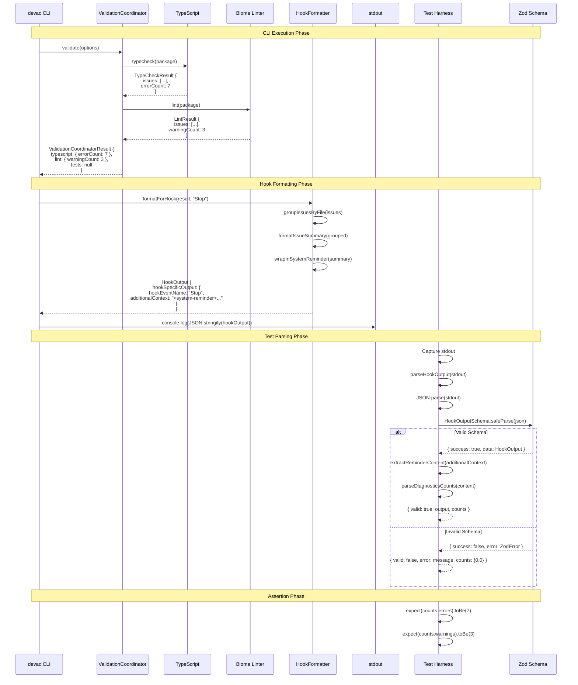
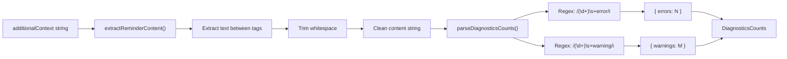

# Hook Output Flow Diagram

This sequence diagram shows how hook output is generated and processed.

## Hook Output Generation and Parsing



## Hook Output Format

### JSON Structure

```json
{
  "hookSpecificOutput": {
    "hookEventName": "Stop",
    "additionalContext": "<system-reminder>\nValidation found issues:\n\n**TypeScript Errors (7)**\n- src/type-errors.ts: 7 errors\n\n**Lint Warnings (3)**\n- src/lint-issues.ts: 3 warnings\n\nConsider fixing these before continuing.\n</system-reminder>"
  }
}
```

### Event Types

| Event | Flag | Purpose |
|-------|------|---------|
| `Stop` | `--on-stop` | End of CLI session, inject context about issues |
| `UserPromptSubmit` | `--inject` | Before user prompt, inject status summary |

### System Reminder Tags

The `additionalContext` field must be wrapped in `<system-reminder>` tags:

```xml
<system-reminder>
Content that Claude Code will see as context
</system-reminder>
```

This is a Claude Code hook contract requirement.

## Content Extraction Flow



### Extraction Example

**Input:**
```
<system-reminder>
Validation found 7 errors and 3 warnings in your code.
</system-reminder>
```

**After `extractReminderContent()`:**
```
Validation found 7 errors and 3 warnings in your code.
```

**After `parseDiagnosticsCounts()`:**
```typescript
{ errors: 7, warnings: 3 }
```

## Schema Validation

### HookOutputSchema (Zod)

```typescript
const HookOutputSchema = z.object({
  hookSpecificOutput: z.object({
    hookEventName: z.enum(["UserPromptSubmit", "Stop"]),
    additionalContext: z.string(),
  }),
});
```

### Validation Behavior

| Input | Result |
|-------|--------|
| Valid JSON matching schema | `{ success: true, data: HookOutput }` |
| Valid JSON wrong schema | `{ success: false, error: ZodError }` |
| Invalid JSON | Throws during `JSON.parse()` |
| Empty string | Treated as "no issues" (valid) |

## Empty Output Handling

When validation finds no issues, the CLI may output:
- Empty string `""`
- Whitespace only `" \n "`
- No output at all

The test harness handles this gracefully:

```typescript
const result = harness.parseHookOutput("");
// Returns: { valid: true, output: null, counts: { errors: 0, warnings: 0 } }
```

This indicates successful validation with no issues to report.

## Error Scenarios

### Parse Error

```typescript
const result = harness.parseHookOutput("not json");
// Returns: {
//   valid: false,
//   output: null,
//   error: "Unexpected token...",
//   counts: { errors: 0, warnings: 0 }
// }
```

### Schema Validation Error

```typescript
const result = harness.parseHookOutput('{"wrong": "structure"}');
// Returns: {
//   valid: false,
//   output: null,
//   error: "Required at hookSpecificOutput",
//   counts: { errors: 0, warnings: 0 }
// }
```

### Missing System Reminder Tags

```typescript
const content = extractReminderContent("No tags here");
// Returns: "" (empty string)
```

## Usage in Tests

```typescript
// Execute CLI
const result = await execCli(["validate", "--on-stop", ...], workspaceDir);

// Parse output
const parsed = harness.parseHookOutput(result.stdout);

// Check validity
if (!parsed.valid) {
  console.error("Parse error:", parsed.error);
  return;
}

// Access structured data
const eventType = parsed.output?.hookSpecificOutput.hookEventName;
const errorCount = parsed.counts.errors;
const warningCount = parsed.counts.warnings;

// Assert
expect(eventType).toBe("Stop");
expect(errorCount).toBe(7);
```
