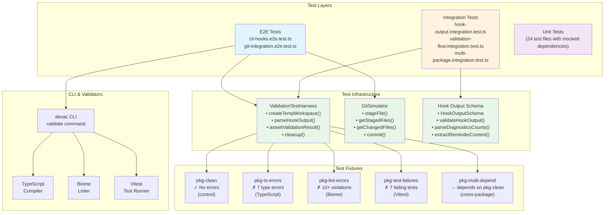

# Test Architecture Diagram

This diagram shows the component relationships in the validation test infrastructure.

## Architecture Overview



## Component Descriptions

### Test Layers

| Layer | Purpose | Speed | Confidence |
|-------|---------|-------|------------|
| E2E | Full process execution | Slowest | Highest |
| Integration | Component interaction | Medium | High |
| Unit | Isolated logic | Fastest | Targeted |

### Test Infrastructure

| Component | Location | Responsibility |
|-----------|----------|----------------|
| ValidationTestHarness | `devac-core/src/test-harness/validation-harness.ts` | Workspace management, assertions |
| GitSimulator | `devac-core/src/test-harness/git-simulator.ts` | Git operations |
| Hook Output Schema | `devac-core/src/test-harness/hook-output-schema.ts` | Output validation |

### Test Fixtures

| Fixture | Error Count | Validation Type |
|---------|-------------|-----------------|
| pkg-clean | 0 | Control/baseline |
| pkg-ts-errors | 7 | TypeScript |
| pkg-lint-errors | 10+ | Biome linting |
| pkg-test-failures | 7 | Test runner |
| pkg-multi-depend | 0 | Dependencies |

## Data Flow

```
Fixtures → Test Harness → Temp Workspace → CLI → Validators → JSON Output → Assertions
```

See [Validation Flow Diagram](./validation-flow.md) for detailed sequence.
