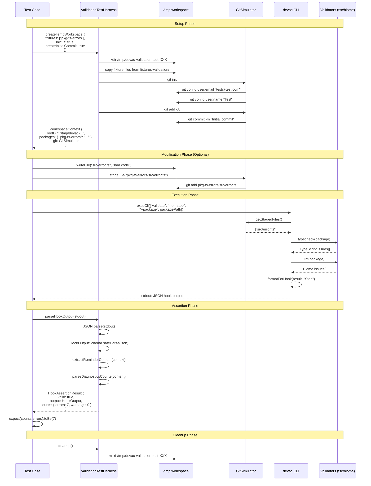

# Validation Flow Diagram

This sequence diagram shows how validation tests execute from setup to assertion.

## Validation Test Execution Flow



## Flow Phases

### 1. Setup Phase

The test harness:
1. Creates a unique temporary directory
2. Copies fixture packages into the workspace
3. Initializes Git repository (if requested)
4. Creates initial commit (if requested)
5. Returns a `WorkspaceContext` with paths and Git simulator

### 2. Modification Phase (Optional)

Tests may:
1. Write new files with errors
2. Modify existing files
3. Stage changes with Git
4. Create complex Git states (staged/unstaged/untracked)

### 3. Execution Phase

The CLI:
1. Determines which files to validate (staged or all)
2. Runs TypeScript compiler for type checking
3. Runs Biome for linting
4. Formats results as hook JSON output
5. Outputs to stdout

### 4. Assertion Phase

The test:
1. Captures CLI stdout
2. Parses JSON with the harness
3. Validates schema compliance
4. Extracts diagnostic counts
5. Asserts expected results

### 5. Cleanup Phase

The harness:
1. Removes temporary directories
2. Frees disk space
3. Prevents test pollution

## Key Data Structures

### WorkspaceContext

```typescript
{
  rootDir: "/tmp/devac-validation-test-abc123",
  packages: {
    "pkg-ts-errors": "/tmp/devac-validation-test-abc123/pkg-ts-errors"
  },
  git: GitSimulator
}
```

### HookAssertionResult

```typescript
{
  valid: true,
  output: {
    hookSpecificOutput: {
      hookEventName: "Stop",
      additionalContext: "<system-reminder>...</system-reminder>"
    }
  },
  counts: {
    errors: 7,
    warnings: 0
  }
}
```
